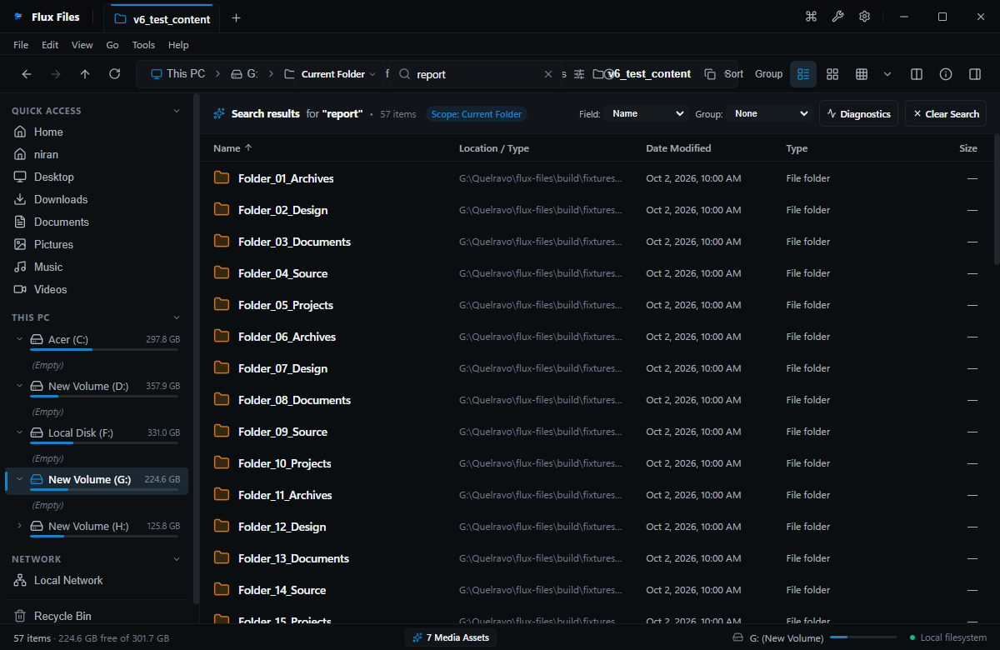

# Flux Files

**Fast. Local. Private. Simple.**

A focused Windows file manager for people who want more control over their files and less interface noise.

`QUELRAVO • v1.0.0`

---

| Metadata | Details |
|---|---|
| **Version** | `1.0.0` (Official Stable Release) |
| **Platform** | Windows 10 (1809+) / Windows 11 |
| **Architecture** | 64-bit (`x64`) |
| **Publisher** | **QUELRAVO** |
| **Repository Type** | Official Public Release & Distribution |

---

### Quick Links

- 🚀 **[Download Release v1.0.0](#download-flux-files-v100)**
- 📖 **[User Handbook](docs/FLUX-FILES-USER-HANDBOOK.md)**
- ⚡ **[Quick Start Guide](docs/QUICK-START.md)**
- ⌨️ **[Keyboard Shortcuts](docs/SHORTCUTS.md)**
- 🛡️ **[Privacy Architecture](docs/PRIVACY.md)**
- 📋 **[Release Changelog](CHANGELOG.md)**

---

## Workspace Overview


---

## Download Flux Files v1.0.0

### Official Distribution Packages

| Package | Filename | Size | SHA-256 Checksum | Download |
|---|---|---|---|---|
| **Windows Installer** | `Flux-Files-1.0.0-Setup.exe` | 99.74 MB | `0059ca4772552f8fd554e56dab40b810bcb786607145ea52b85d78fb9cca0582` | [Download Installer](https://github.com/impreseo/flux-files-releases/releases/download/v1.0.0/Flux-Files-1.0.0-Setup.exe) |
| **Standalone Portable** | `Flux-Files-1.0.0-Portable.exe` | 99.44 MB | `4cd9c174947f8ae264e7cd7c94575fcce9390812273f69f80043cdcca3e88be5` | [Download Portable](https://github.com/impreseo/flux-files-releases/releases/download/v1.0.0/Flux-Files-1.0.0-Portable.exe) |
| **Integrity Checksums** | `SHA256SUMS.txt` | 189 B | `140b5776cbddce2e98e64c58560af137bf43878cf96e9098c3962ea59a7c0925` | [Download Hashes](https://github.com/impreseo/flux-files-releases/releases/download/v1.0.0/SHA256SUMS.txt) |

👉 **Official GitHub Release Page**: **[Flux Files v1.0.0 Release](https://github.com/impreseo/flux-files-releases/releases/tag/v1.0.0)**

---

## Verification & Checksums

Verify the cryptographic SHA-256 digest of your download in PowerShell:

```powershell
# Verify Setup Installer
Get-FileHash -Algorithm SHA256 .\Flux-Files-1.0.0-Setup.exe

# Verify Portable Executable
Get-FileHash -Algorithm SHA256 .\Flux-Files-1.0.0-Portable.exe
```

Expected Hashes:
```text
0059ca4772552f8fd554e56dab40b810bcb786607145ea52b85d78fb9cca0582  Flux-Files-1.0.0-Setup.exe
4cd9c174947f8ae264e7cd7c94575fcce9390812273f69f80043cdcca3e88be5  Flux-Files-1.0.0-Portable.exe
```

---

## What is Flux Files?

Flux Files is a high-performance desktop file manager engineered from the ground up for Windows. Designed for users who demand instant responsiveness, airtight privacy, and built-in professional utilities, Flux Files eliminates the sluggishness, cloud bloat, and telemetry of traditional file explorers.

### Built for Real File Work
- **Fast Navigation**: Hardware-accelerated virtualized list rendering handles folders containing tens of thousands of items at 60 FPS.
- **Dense Information**: Clean, configurable layouts maximize screen real estate and directory hierarchy visibility.
- **Direct Manipulation**: Side-by-side Dual-Pane browsing (`Ctrl+Alt+2`) enables rapid cross-folder file organization and drag-and-drop transfers.
- **Useful Previews**: Native viewers for over 50 file types open instantaneously with **Spacebar** without launching external applications.
- **Powerful Search**: In-folder zero-latency memory filter (`Ctrl+F`) and cross-drive SQLite Everywhere search (`Ctrl+Shift+F`) with query syntax operators.
- **Practical Power Tools**: Multi-regex Batch Renamer, Storage Analyzer treemaps, Duplicate File Finder, and Cryptographic Hash Calculator.
- **Local-First Privacy**: 100% on-device computation. No cloud accounts, no diagnostic beacons, no telemetry tracking.

---

## Real Screenshot Showcase

The following screenshots are authentic captures from the production **Flux Files v1.0.0** application:

### 1. Explorer & Details View
*Sortable metadata columns, folder memory, and virtualized rendering.*


### 2. Everywhere Search Engine
*Multi-volume indexed search across all local drives with query syntax operators.*


### 3. Universal In-App File Viewers
*Instant Spacebar previews for Markdown, Code, JSON, CSV, PDF, Hex, 3D, and Fonts.*


### 4. Integrated Atomic Editors
*In-place text editing and split Markdown authoring with crash-proof atomic temporary file writes.*


### 5. Multitasking Workspaces & Dual Pane
*Side-by-side independent viewports with fast cross-pane transfers (`F5` copy, `F6` move).*


### 6. Built-In Power Tools Suite
*Batch Renamer, Storage Analyzer, Duplicate Finder, and Cryptographic Hash utility.*


### 7. Appearance & Desktop Themes
*5 theme presets (Flux Dark Slate, Flux Light, Slate, Graphite, System Sync) and 3 density modes.*


---

## Core Capabilities

### Explore
- **8 Layout Engines**: Details, List, Compact Grid, Medium Icons, Large Icons, Extra Large Icons, Gallery View (carousel with filmstrip), and Miller Columns (cascading traversal).
- **Interactive Breadcrumbs**: Clickable directory tokens with sibling dropdown menus, plus instant `Ctrl+L` direct address editing.
- **Folder Memory**: Preserves view layout, column widths, sort order, and grouping preferences independently per directory.

### Search
- **Instant In-Folder Filter (`Ctrl+F`)**: Type in the search box for zero-latency memory filtering.
- **Everywhere Global Search (`Ctrl+Shift+F`)**: Multi-volume SQLite-backed indexed search across all mounted drives.
- **Syntax Operators**: Precise filtering with `ext:pdf`, `type:image`, `size:>100MB`, and wildcard expressions.

### View and Edit
- **Universal Viewers**: Instant Spacebar inspection for GitHub Flavored Markdown, syntax-highlighted code across 40+ grammars, collapsible JSON tree, virtualized CSV spreadsheet grid, multi-page PDF reader, 16-byte binary Hex, 3D WebGL mesh (OBJ, STL, GLTF), 2D DXF CAD wireframes, and typography font specimens.
- **Integrated Editors**: In-place text editor and live split-pane Markdown editor with synchronized live HTML preview.
- **Atomic Safe Writes**: Writes to temporary staging files before replacing on disk, preventing file corruption on unexpected power loss.

### Media and Archives
- **Virtual Archive Studio**: Browse inside ZIP, 7Z, TAR, and GZ archives as virtual folders without unpacking to disk. Create compressed archives with selectable compression ratios and AES-256 password encryption.
- **Media Playback**: Hardware-accelerated desktop video player (MP4, WebM, MKV) with frame scrubbing, and audio player with interactive waveform visualizer and ID3 metadata display.

### Workspaces and Power Tools
- **Tabbed Browsing**: Multi-tab strip with pinned project tabs, tab duplication, and session restoration.
- **Dual-Pane Split View (`Ctrl+Alt+2`)**: Two independent explorer viewports enabling fast comparisons and drag-and-drop transfers.
- **Power Tools Suite**: Multi-file Batch Renamer (`Ctrl+Shift+R`), Storage Analyzer disk usage breakdown, Duplicate File Finder, and Cryptographic Hash Calculator (MD5, SHA-1, SHA-256, SHA-512).

### Windows Integration
- **Drives Hub**: Visual capacity meters for fixed partitions (NTFS, exFAT, ReFS), removable USB drives, and network shares.
- **Shell Handoff**: Native Windows Recycle Bin COM integration with safe recovery, extended MAX_PATH (`\\?\`) support, and "Open With" app dispatch.

### Privacy & Air-Gap Assurance
- **100% On-Device**: All search indexing, thumbnail caches, and operations execute locally on your machine.
- **Zero Telemetry**: No analytics beacons, no path logging, no error uploaders.
- **Air-Gapped Ready**: Operates identically with or without an active internet connection.

---

## Installation & Setup

### Windows Setup Installer (Recommended)
1. Download `Flux-Files-1.0.0-Setup.exe`.
2. Run the installer and follow the setup wizard.
3. Start Menu shortcuts, desktop icons, and uninstallation entries are created automatically.

### Standalone Portable Version
1. Download `Flux-Files-1.0.0-Portable.exe`.
2. Place the executable in any folder or removable USB drive.
3. Double-click to run immediately without administrative privileges or registry modification.

> **Note on Windows SmartScreen**: The v1.0.0 release is self-contained and packaged without an extended validation (EV) certificate. Windows Defender SmartScreen may display an informational notice on first launch. Click **"More info"** → **"Run anyway"**.

---

## System Requirements

- **Operating System**: Windows 10 (1809+) or Windows 11
- **Architecture**: 64-bit (`x64`)
- **Memory**: 4 GB RAM minimum (8 GB recommended)
- **Storage**: 250 MB available disk space

---

## Documentation Library

Complete user documentation is included in the [`docs/`](docs/) directory:

- 📖 [**Full User Handbook**](docs/FLUX-FILES-USER-HANDBOOK.md) — Comprehensive 20-chapter operational manual.
- ⚡ [**Quick Start Guide**](docs/QUICK-START.md) — 10-step visual onboarding guide.
- ⌨️ [**Keyboard Shortcuts**](docs/SHORTCUTS.md) — Master accelerator cheat-sheet.
- 🛡️ [**Privacy & Security Architecture**](docs/PRIVACY.md) — Local-first verification details.
- 📋 [**Release Changelog**](CHANGELOG.md) — Version 1.0.0 release notes.

---

## Publisher & Repository Purpose

Published by **QUELRAVO**.  
*Official Public Distribution Repository*: [https://github.com/impreseo/flux-files-releases](https://github.com/impreseo/flux-files-releases)  
*This repository serves as the official public binary distribution and user documentation channel. Source code development is maintained privately by QUELRAVO.*

Copyright © 2026 **QUELRAVO**. All rights reserved.  
*Flux Files is a registered trademark of QUELRAVO.*
