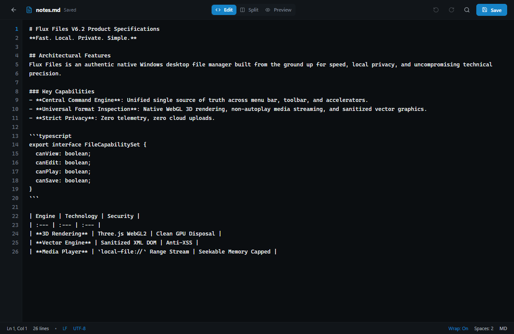

# Flux Files

**FAST. LOCAL. PRIVATE. SIMPLE.**

---

## Flux Files 1.0.0
*Official Stable Windows Release by **QUELRAVO**.*

Flux Files is a high-performance desktop file manager engineered from the ground up for Windows. Designed for users who demand instant responsiveness, airtight privacy, and built-in professional utilities, Flux Files eliminates the sluggishness and cloud lock-in of traditional file managers.


---

## Download Flux Files 1.0.0

### Windows Installer (Recommended)
Complete Windows installer with Start Menu shortcuts and shell integration.
- 📦 **[Download Flux-Files-1.0.0-Setup.exe](https://github.com/impreseo/flux-files-releases/releases/download/v1.0.0/Flux-Files-1.0.0-Setup.exe)** *(99.74 MB)*

### Portable Version
Zero-installation standalone executable. Run immediately from local storage or USB drives.
- 🚀 **[Download Flux-Files-1.0.0-Portable.exe](https://github.com/impreseo/flux-files-releases/releases/download/v1.0.0/Flux-Files-1.0.0-Portable.exe)** *(99.44 MB)*

### Cryptographic Checksums (SHA-256)
Verify download integrity against the official checksums:
- 🛡️ **[SHA256SUMS.txt](https://github.com/impreseo/flux-files-releases/releases/download/v1.0.0/SHA256SUMS.txt)**

```text
aa1613cff43c1979c13f5929f207a59b465b1bae808fa2b4da8252cb6915dd33  Flux-Files-1.0.0-Portable.exe
1b5ff297d6fdc64fbaa90df01f508fa6428722a9ecf715d78958158e765677a3  Flux-Files-1.0.0-Setup.exe
```

---

## Core Capabilities

### ⚡ Blazing Fast Explorer
- **8 Layout Engines**: Details, List, Compact Grid, Medium Icons, Large Icons, Extra Large Icons, Gallery View (media carousel with filmstrip), and Miller Column View.
- **Virtualized Rendering**: Handles directories containing tens of thousands of items at a silky 60 FPS.
- **Interactive Breadcrumbs**: Clickable directory tokens with sibling dropdown menus, plus instant `Ctrl+L` direct path entry.

### 🔍 Incident-Resistant Search Engine

- **Instant In-Folder Filter**: Type in the search box (`Ctrl+F`) for instantaneous memory filtering.
- **Everywhere Global Search**: Multi-drive SQLite-backed indexed search (`Ctrl+Shift+F`) across all mounted volumes.
- **Syntax Operators**: Precise filtering with `ext:pdf`, `type:image`, `size:>100MB`, and wildcard expressions.

### 👁️ Universal In-App File Viewers

Inspect over 50 formats immediately with **Spacebar** without launching heavy third-party software:
- **Documents & Code**: GitHub Flavored Markdown, syntax-highlighted code (TS, JS, Python, Rust, Go, C/C++), line numbers, and PDF multi-page viewing.
- **Data & Tables**: Collapsible JSON tree explorer and virtualized CSV/TSV spreadsheet data grid.
- **3D & Vector CAD**: Interactive WebGL mesh orbit/pan/zoom (OBJ, STL, GLTF, GLB) and 2D DXF CAD wireframes.
- **Typography & Forensic**: Waterfall font specimen preview (TTF, OTF, WOFF) and 16-byte aligned binary Hexadecimal viewer.

### ✍️ Integrated Atomic Editors

- In-place text and source code editing with find and replace (`Ctrl+F`).
- Live split-pane Markdown editor with synchronized HTML preview.
- **Atomic Safe Writes**: Writes to temporary staging files before replacing on disk, preventing file corruption during power failures.

### 📦 Virtual Archive Studio
- Browse inside ZIP, 7Z, TAR, and GZ archives as virtual folders without unpacking.
- Multi-threaded archive extraction with collision handling (Prompt, Overwrite, Skip).
- Create compressed archives with selectable compression levels (Store, Fast, Normal, Maximum).

### 🪟 Multitasking Workspaces & Dual Pane

- Multi-tab navigation with pinned tabs and session restoration.
- Side-by-side **Dual-Pane Split View** (`Ctrl+Alt+2`) for seamless drag-and-drop transfers between directories.

### 🛠️ Built-In Power Tools

- **Batch Renamer**: Mass renaming tool with find/replace, prefixes, suffixes, case conversion, and numbering.
- **Storage Analyzer**: Visual volume capacity breakdown to identify disk hogs.
- **Duplicate Finder**: Multi-stage byte and SHA-256 duplicate identification.
- **Cryptographic Hashes**: On-demand calculation of MD5, SHA-1, and SHA-256 checksums with match verification.

### 🛡️ 100% Local-First Privacy Guarantee
- **Zero Cloud Dependencies**: No user accounts, no subscriptions, no cloud syncing.
- **Zero Telemetry**: No analytics beacons, no path snooping, no diagnostic tracking.
- **Air-Gapped Ready**: Runs identically with or without an active internet connection.

---

## Documentation

- 🚀 [**Quick Start Guide**](docs/QUICK-START.md) — 10-step onboarding visual guide.
- 📖 [**Full User Handbook**](docs/FLUX-FILES-USER-HANDBOOK.md) — Comprehensive 20-chapter manual.
- ⌨️ [**Keyboard Shortcuts**](docs/SHORTCUTS.md) — Master accelerator cheat-sheet.
- 🛡️ [**Privacy & Security Architecture**](docs/PRIVACY.md) — Local-first verification details.
- 📋 [**Release Changelog**](CHANGELOG.md) — Version release notes.

---

## System Requirements

- **Operating System**: Windows 10 or Windows 11 (64-bit)
- **Processor**: 64-bit Intel, AMD, or compatible processor
- **Memory**: 4 GB RAM minimum (8 GB recommended)
- **Storage**: 250 MB available disk space

---

## Publisher & Support

Published by **QUELRAVO**.  
*Official Release Repository*: [https://github.com/impreseo/flux-files-releases](https://github.com/impreseo/flux-files-releases)  
Copyright © 2026 **QUELRAVO**. All rights reserved.
