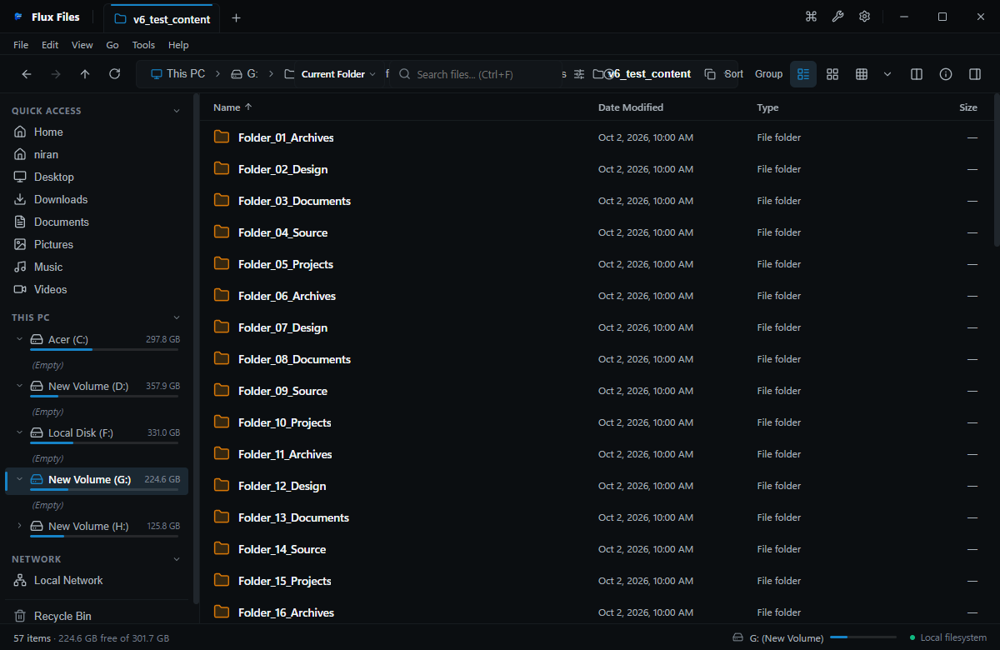

# Interface Overview

## Overview
The Flux Files interface is structured into modular, persistent desktop zones engineered for rapid ergonomics, clear spatial orientation, and fluid keyboard control.

## Workspace Layout

*Figure 00.2: Standard Flux Files layout displaying Menu Bar, Tab Strip, Address Bar, Breadcrumbs, Sidebar, Explorer View, and Status Bar.*

### Main UI Zones
| Zone | Location | Primary Purpose | Key Controls |
|---|---|---|---|
| **Title Bar & Tab Strip** | Top Window Edge | Window management, tab organization, window controls | Close, Min, Max, New Tab (+), Tab Pinned Badge |
| **Menu Bar** | Below Tab Strip | Access to top-level command menus | File, Edit, View, Go, Tools, Help |
| **Toolbar** | Below Menu Bar | Navigation history, path breadcrumbs, search, view modes | Back, Forward, Up, Breadcrumbs, Search, View Mode |
| **Navigation Sidebar** | Left Pane | Hierarchy tree for drives, pinned hubs, and user folders | Expand/Collapse, Drive meters, Favorites |
| **Explorer Workspace** | Center Viewport | File and folder contents listing, grid, or miller columns | Selection items, context menus, drag surface |
| **Preview / Details Pane**| Right Pane (Optional) | Real-time file inspection, metadata, and quick actions | Toggle Preview (`Ctrl+Shift+P`), Toggle Details (`Ctrl+Shift+D`) |
| **Status Bar** | Bottom Window Edge | Item count, selection statistics, total size, storage meters | Item counts, selection capacity, view shortcuts |

## Theming & Visual Aesthetics

*Figure 00.3: Flux Dark theme presenting engineered neutral tones with technical blue accents.*

Flux Files supports curated color palettes designed for visual clarity:
- **Flux Dark (Default)**: Deep engineered neutral slate (`#090B0D`) with focused technical blue accents (`#1683C7`).
- **Flux Light**: Clean neutral daylight theme with high contrast border delineation.
- **Slate**: Dark blue-gray industrial palette.
- **Graphite**: Pure monochrome platinum palette.
- **System Sync**: Dynamically mirrors Windows OS light/dark modes.

## Density Profiles
- **Compact**: Tightly packed item rows for high-density directory curation.
- **Default**: Standard desktop ergonomics balancing icon visibility with row spacing.
- **Comfortable**: Generous touch- and accessibility-friendly spacing with enlarged hit targets.

## Related
- [Product Overview](./product-overview.md)
- [Navigation Architecture](../01-navigation/navigation.md)
- [Appearance Settings](../13-settings/appearance.md)
- [Theme Customization](../13-settings/themes.md)
