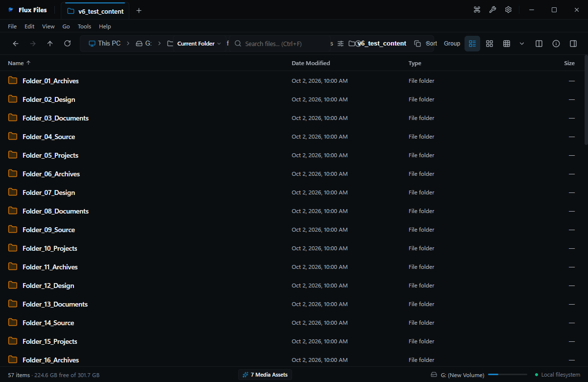

# Sidebar Navigation

## Overview
The Sidebar is the persistent anchor on the left edge of Flux Files. It provides instantaneous access to the Virtual Home, drive volumes, pinned folders, and user libraries.

## Interface States

*Figure 01.2: Expanded sidebar showing Drive Volumes, User Libraries, and Pinned Shortcuts.*

*Figure 01.3: Collapsed sidebar mode maximizing screen real estate for explorer views.*

## Sections & Controls
- **Home**: Synthetic dashboard containing recent files and favorite folder cards.
- **This PC**: Root view displaying all detected fixed and removable drives.
- **Pinned Locations**: Custom user bookmarks that can be added via context menus or drag-and-drop.
- **Standard Libraries**: Direct access to Desktop, Documents, Downloads, Pictures, Music, and Videos.
- **Drives & Partitions**: Shows drive letter, partition name, and remaining storage meter bars.
- **Recycle Bin**: Direct access to Windows Recycle Bin.

## How to Use
1. **Expand/Collapse**: Click the hamburger icon at the top left of the toolbar or toggle via View menu to collapse the sidebar to icon-only mode.
2. **Pin Folder**: Right-click any folder in the Explorer and select **Pin to Sidebar**.
3. **Unpin Folder**: Right-click the pinned item in the sidebar and choose **Unpin**.
4. **Navigate**: Click any sidebar item to immediately update the active tab's location.

## Notes & Limitations
- Removable media (e.g. USB flash drives) dynamically appear in the Drives section upon connection and vanish upon safe ejection.
- Network locations mapped to Windows drive letters appear automatically under This PC.

## Related
- [Navigation Overview](./navigation.md)
- [Drives & Volumes](../03-explorer/drives.md)
- [Explorer Settings](../13-settings/explorer-settings.md)
