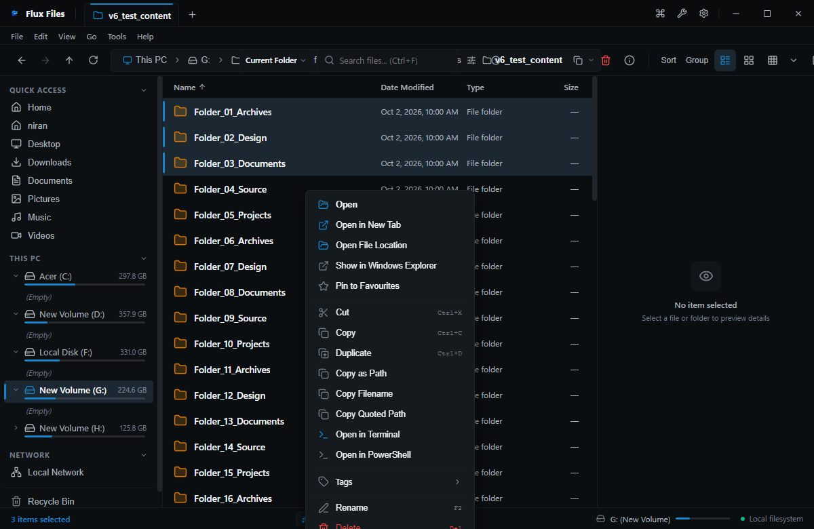

# Context Menus

## Overview
Right-clicking any element in Flux Files invokes contextual menus tailored specifically to the clicked target: files, folders, whitespace background, tabs, or breadcrumb segments.

## Interface

*Figure 02.5: Context menu displayed for a selected file item.*

## Context Menu Types
1. **File Item Context Menu**:
   - Open / Open in New Tab
   - Open With...
   - Preview in In-App Viewer
   - Cut (`Ctrl+X`), Copy (`Ctrl+C`), Copy Path
   - Create Archive (ZIP, 7Z, TAR)
   - Batch Rename (Power Tools)
   - Calculate Hashes
   - Delete (`Delete`) / Delete Permanently (`Shift+Delete`)
   - Properties (`Alt+Enter`)
2. **Folder Context Menu**:
   - Open in New Tab / Open in New Window
   - Open in Terminal / PowerShell
   - Pin to Sidebar
   - Storage Breakdown
   - Cut / Copy / Copy Path
   - Archive Folder
   - Properties
3. **Whitespace (Background) Context Menu**:
   - View Mode selector
   - Sort By & Group By
   - Refresh (`F5`)
   - Paste (`Ctrl+V`)
   - New Folder (`Ctrl+Shift+N`)
   - New File (`Ctrl+Alt+N`)
   - Open Terminal Here
   - Folder Properties

## Related
- [File Operations](../04-file-operations/create.md)
- [Power Tools](../10-power-tools/batch-renamer.md)
