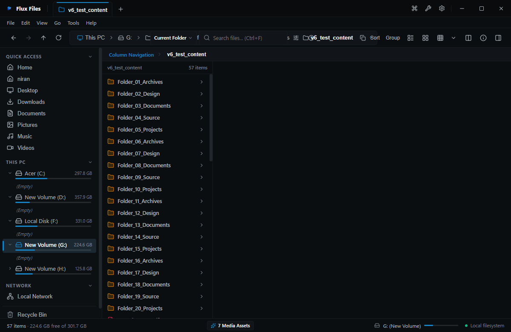

# Column View (Miller Columns)

## Overview
Column View implements classical Miller Columns navigation, displaying parent, current, and child directory levels horizontally in adjacent panes.

## Visual Interface

*Figure 03.8: Miller Columns layout showing cascading horizontal hierarchy and file preview pane.*

## How to Use
1. Click a folder in Column 1: its child files and folders render in Column 2.
2. Click a subfolder in Column 2: its contents render in Column 3.
3. Click a file in the final column: an automatic instant preview and metadata card renders in the inspection pane on the right.
4. Navigate effortlessly using keyboard arrows: `Left` to step up, `Right` to step down, `Up` / `Down` to select sibling files.

## Related
- [View Modes](./view-modes.md)
- [Navigation Overview](../01-navigation/navigation.md)
