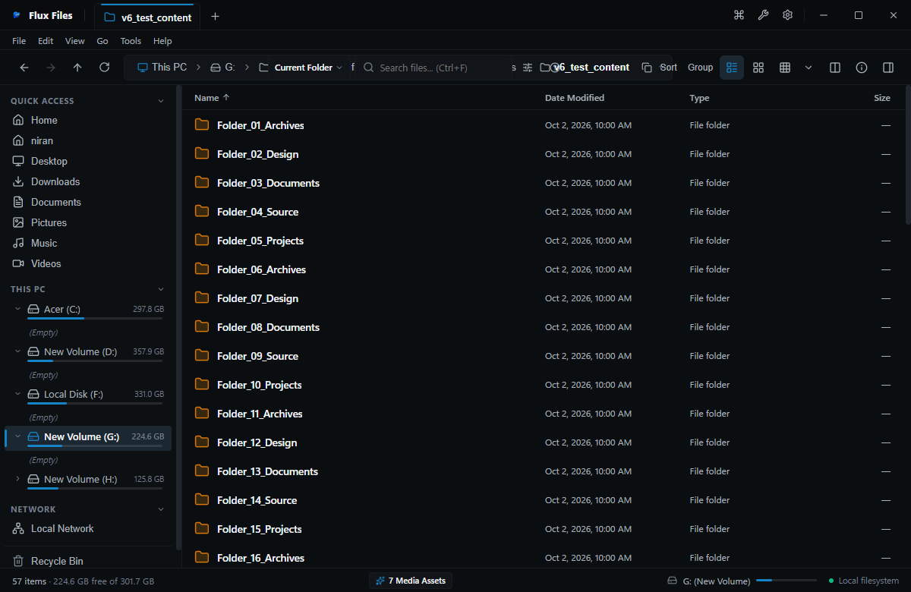

# Details View

## Overview
Details View is the standard power-user layout. It organizes files and folders in tabular rows with customizable, resizable columns.

## Visual Interface

*Figure 03.5: Details view showing column headers, item badges, and timestamp formatting.*

## Standard Columns
- **Name**: File name, extension, and system format icon.
- **Date Modified**: Date and time of last modification.
- **Type**: Friendly format descriptor (e.g. `TypeScript Source`, `PNG Image`).
- **Size**: Human-readable file size with units (B, KB, MB, GB).

## How to Customize
- Drag column separator boundaries to resize column widths.
- Click any column header to sort by that attribute.
- Right-click column header to toggle additional columns (Date Created, Attributes, SHA-256).

## Related
- [View Modes](./view-modes.md)
- [Sorting](./sorting.md)
