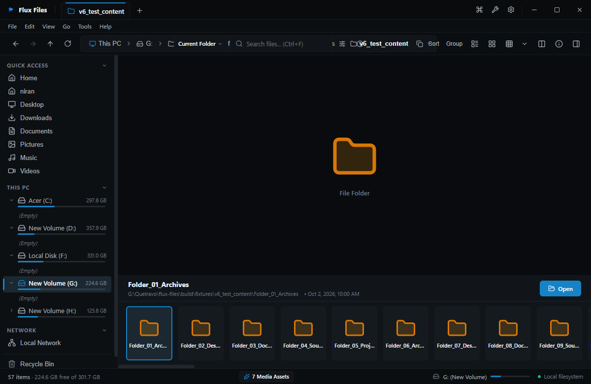

# Gallery View

## Overview
Gallery View is a media-centric layout that presents an enlarged preview viewport above a horizontally scrolling thumbnail filmstrip.

## Visual Interface

*Figure 03.7: Gallery view featuring central preview showcase with interactive thumbnail filmstrip below.*

## Interactive Controls
- **Arrow Keys (`Left` / `Right`)**: Step through items sequentially.
- **Filmstrip Click**: Instantly loads clicked media into the central preview.
- **Full Screen**: Double-click central preview to launch full-screen media viewer.

## Related
- [Media Viewer](../08-media/image-viewer.md)
- [View Modes](./view-modes.md)
