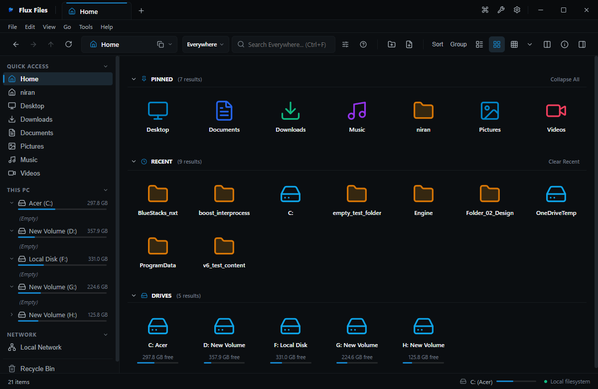

# Virtual Home Dashboard

## Overview
Virtual Home (`flux://home`) is the default landing hub in Flux Files. It aggregates user favorites, system library shortcuts, detected storage volumes, and recent activity into an organized, at-a-glance dashboard.

## Visual Interface

*Figure 03.2: Virtual Home dashboard showing Quick Access hubs, Drive storage meters, and Recent Files.*

## Available Dashboard Sections
1. **Quick Access / Pinned Folders**: User-curated folder cards for immediate one-click navigation.
2. **Drive Volumes**: Visual card for each connected storage drive showing letter, volume label, total space, and remaining capacity bar.
3. **Recent Files**: Most recently opened documents, media, and projects with last-accessed timestamps.
4. **Library Hubs**: Direct links to Desktop, Downloads, Documents, Pictures, Music, and Videos.

## How to Customize
- Navigate to **Settings (`Ctrl+,`) → Home** to toggle individual sections on or off.
- Drag and drop pinned cards to reorder.
- Right-click any recent file card to remove it from history or clear recent files.

## Related
- [Interface Overview](../00-overview/interface-overview.md)
- [This PC](./this-pc.md)
- [Home Settings](../13-settings/explorer-settings.md)
