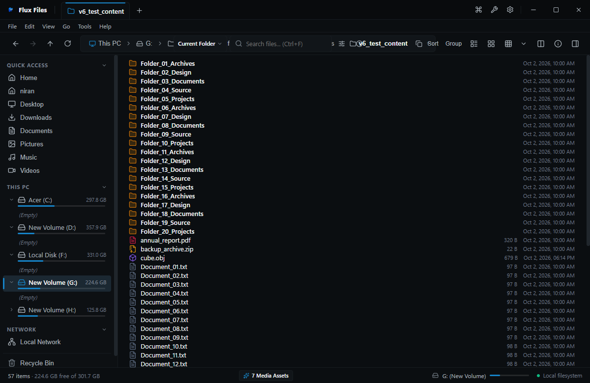

# List View

## Overview
List View arranges files in compact vertical columns that wrap horizontally across the viewport, maximizing visible items without horizontal scrolling.

## Visual Interface

*Figure 03.6: List view presenting dense filenames and compact format icons.*

## Ideal Use Cases
- Scanning large code repositories, log directories, or document folders.
- Fast visual alphabetical lookup.

## Related
- [View Modes](./view-modes.md)
- [Details View](./details-view.md)
