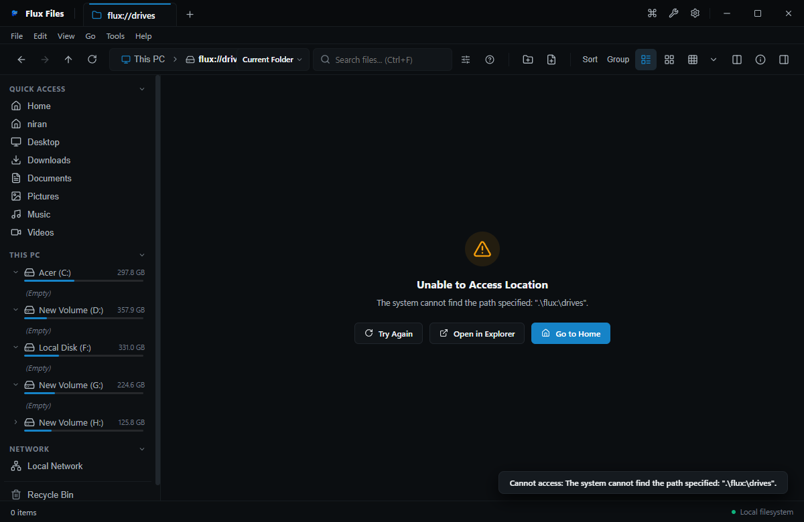

# This PC & Storage Hub

## Overview
**This PC** provides high-level hardware visibility across all physical disk drives, mounted partitions, external USB media, and mapped network drives attached to the Windows host.

## Visual Interface

*Figure 03.3: This PC showing fixed local drives, removable volumes, and filesystem formats.*

## Displayed Attributes
- **Drive Letter & Name**: e.g., `Local Disk (C:)`, `Media Vault (D:)`.
- **Filesystem Type**: NTFS, exFAT, FAT32, or ReFS.
- **Capacity Meter**: Visual fill bar colored blue under 85% capacity, transitioning to warning amber/red when storage is nearly exhausted.
- **Numeric Space**: Free gigabytes remaining out of total disk volume capacity.

## How to Use
- Double-click any drive card to navigate into its root directory.
- Right-click a drive card to inspect **Properties**, launch **Storage Breakdown**, or safely **Eject** removable media.

## Related
- [Drives & Volumes](./drives.md)
- [Storage Breakdown](../10-power-tools/storage-analyzer.md)
- [Windows Integration](../12-windows/windows-integration.md)
