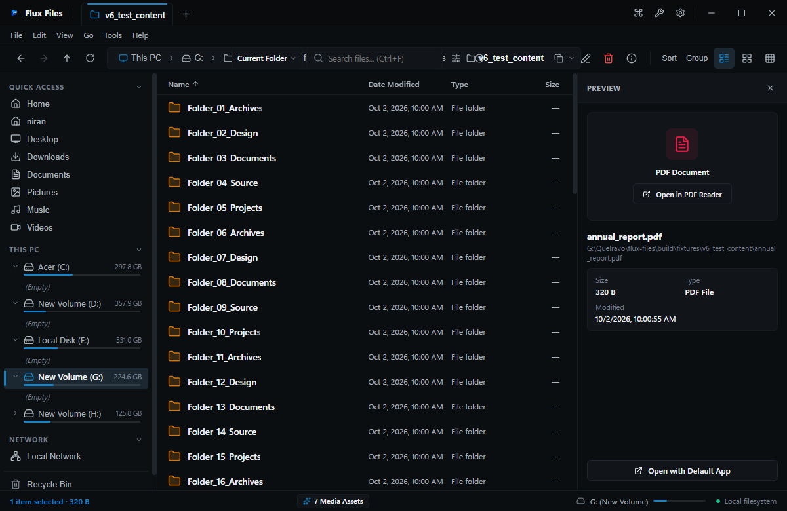
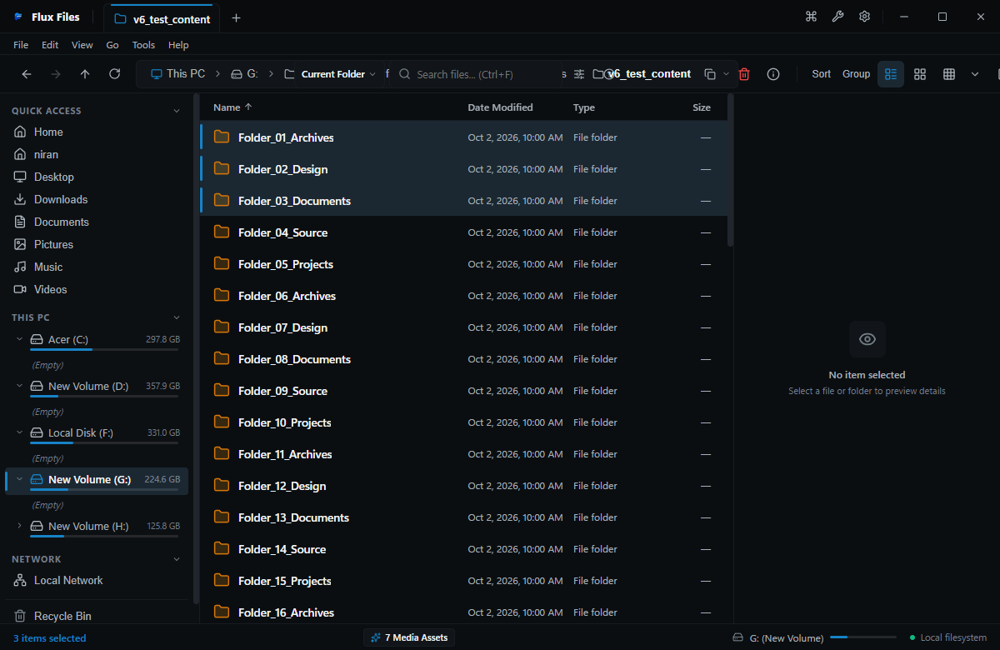

# Copying Files & Folders

## Overview
Copying duplicates filesystem entities to a new destination while leaving the source files intact.

## Visual Interface

*Figure 04.3: Single file selected ready for clipboard staging.*

*Figure 04.4: Multiple items selected for batch copy operation.*

## Copy Workflow
1. Select target file(s) or folder(s).
2. Press `Ctrl+C` or select **Edit → Copy**.
3. Navigate to target folder (in current tab, another tab, or secondary pane).
4. Press `Ctrl+V` or select **Edit → Paste**.

## Background Execution
Copy operations run asynchronously through the **Operation Center**, displaying real-time transfer throughput (MB/s), elapsed time, remaining byte counts, and cancellation buttons.

## Related
- [Cutting](./cut.md)
- [Pasting](./paste.md)
- [Operation Center](./operation-center.md)
- [Conflict Resolution](./conflicts.md)
