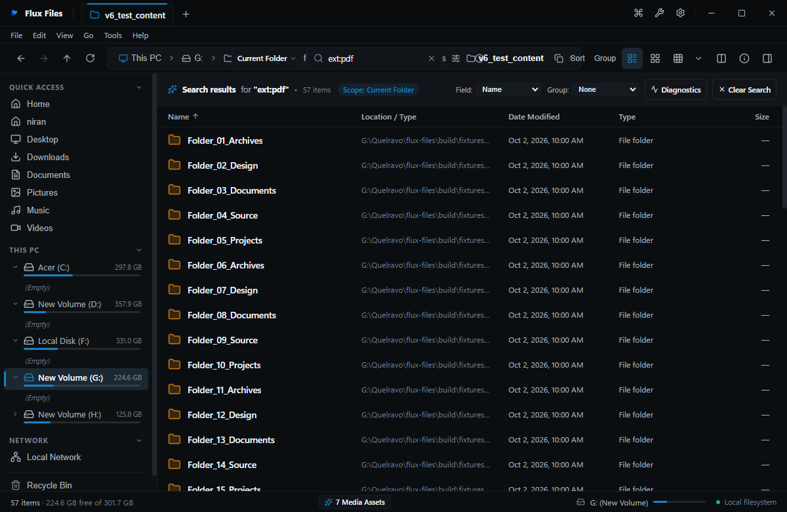

# Search Filters & Syntax Reference

## Overview
Flux Files supports advanced query syntax for pinpointing specific items in large collections.

## Visual Interface

*Figure 05.3: Syntax search using extension filters.*

*Figure 05.4: Filtering search results by format category.*

## Syntax Reference Table
| Operator | Syntax Example | Meaning |
|---|---|---|
| **Extension** | `ext:pdf` or `ext:ts,tsx` | Matches files with specified extensions. |
| **Category** | `type:image`, `type:code`, `type:audio` | Matches all formats within category. |
| **Size** | `size:>50MB`, `size:<10KB` | Filters by byte thresholds (B, KB, MB, GB). |
| **Modified** | `modified:today`, `modified:2026-10` | Filters by modification date range. |
| **Exact Phrase**| `"final budget"` | Matches literal text string inside quotation marks. |

## Combining Filters
Filters can be concatenated freely:
`quarterly report ext:docx size:>1MB modified:2026`

## Related
- [Search Overview](./search-overview.md)
- [Sorting Results](./sorting-results.md)
