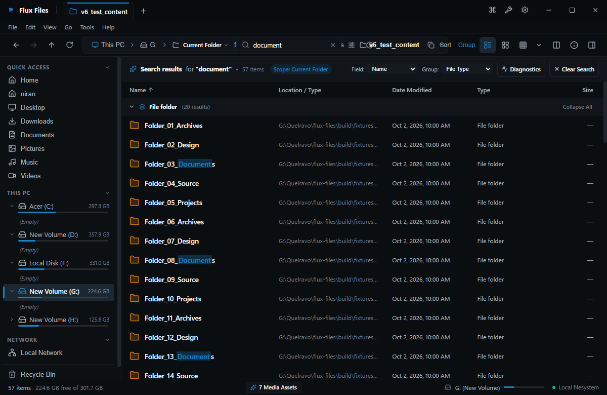

# Sorting Search Results

## Overview
Search results can be sorted and grouped dynamically using the standard Explorer view tools.

## Visual Interface

*Figure 05.5: Search results organized into expandable format category groups.*

## Sorting Options
- **Relevance**: Best lexical match scored by filename and path proximity.
- **Date Modified**: Most recently changed items first.
- **Size**: Largest files first (useful for disk cleanup).
- **Path**: Alphabetical by directory location.

## Related
- [Grouping Guide](../03-explorer/grouping.md)
- [Search Overview](./search-overview.md)
