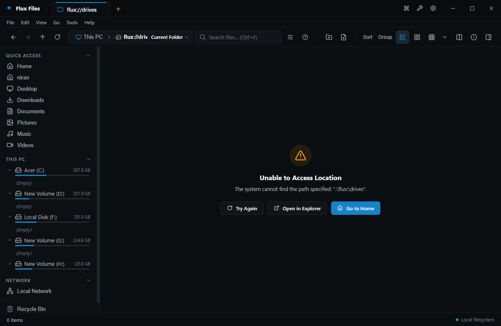

# Storage Breakdown & Analyzer

## Overview
The Storage Breakdown tool visualizes disk space allocation across directories and drive partitions.

## Visual Interface

*Figure 10.2: Storage Breakdown displaying hierarchical size allocation and format breakdown.*

*Figure 10.3: Visual drive capacity meters and filesystem indicators.*

## Features
- **Visual Treemap / Sunburst**: Interactive hierarchical visualization of directory sizes.
- **Top Space Consumers**: Lists the largest individual files and folders.
- **Format Breakdown**: Displays disk usage partitioned by category (Media, Code, Archives, System).

## Related
- [This PC](../03-explorer/this-pc.md)
- [Duplicate Finder](./duplicate-finder.md)
