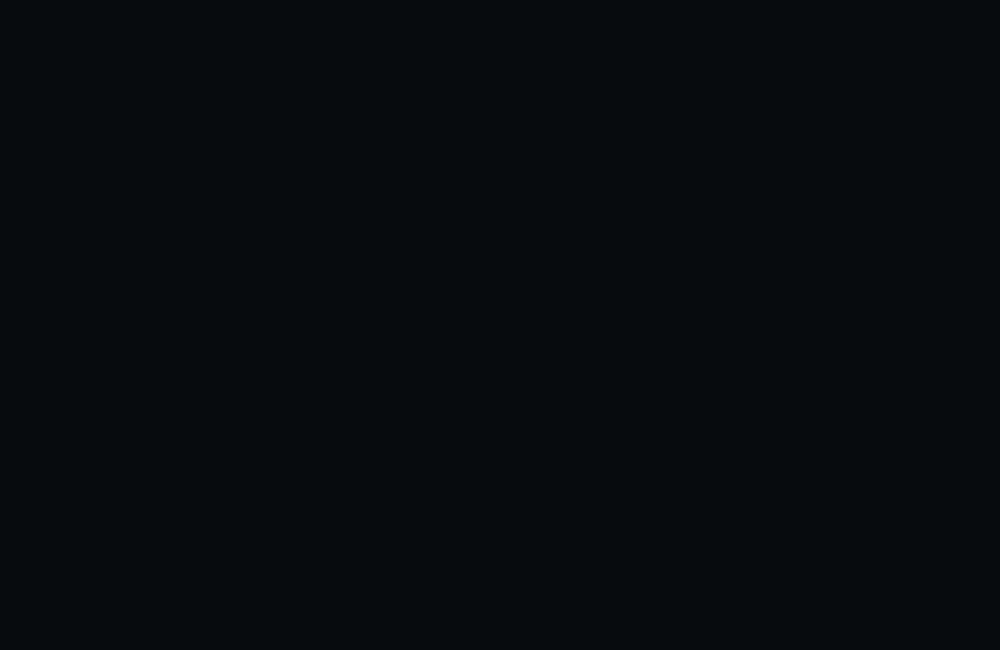
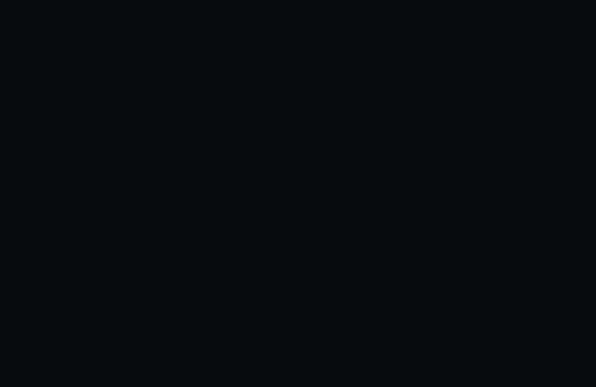

# Flux Files Archive Guide
**Virtual Archive Browsing, Extraction & Compression Studio**  
*Quelravo Systems • Fast. Local. Private. Simple.*

---

Compressed archives are a cornerstone of modern digital storage. Flux Files treats archives as first-class virtual file systems, allowing you to browse, inspect, and extract compressed containers without requiring standalone third-party archive tools.

---

## 1. Supported Archive Formats

| Format | Extension | Browse | Extract | Create |
|---|---|:---:|:---:|:---:|
| **ZIP Archive** | `.zip` | Yes | Yes | Yes |
| **7-Zip Archive** | `.7z` | Yes | Yes | Yes |
| **Tape Archive** | `.tar` | Yes | Yes | Yes |
| **Gzip Compressed TAR** | `.tar.gz`, `.tgz` | Yes | Yes | Yes |
| **Gzip Compressed Single File** | `.gz` | Yes | Yes | Yes |

---

## 2. Virtual Archive Browser

### Seamless In-Archive Exploration
- **How to Open**: Double-click any supported archive file in the explorer.
- **Behavior**: Flux Files opens the archive as a virtual folder hierarchy without decompressing files to disk first.
- **Capabilities**:
  - Navigate subfolders inside the archive using standard breadcrumbs.
  - View compressed byte sizes, uncompressed sizes, and compression ratios per item.
  - Preview packaged images, text files, and code files directly in the Inspector pane.

---

## 3. Extracting Archives

### High-Speed Extraction
1. Select an archive file and press **`Ctrl+Shift+X`**, or right-click and choose **Extract Archive**.
2. The extraction dialog lets you configure:
   - **Destination Directory**: Defaults to an auto-created subfolder named after the archive.
   - **Conflict Resolution**:
     - *Prompt on Collision*: Asks for confirmation before replacing existing files.
     - *Overwrite All*: Replaces conflicting target files automatically.
     - *Skip Existing*: Preserves destination files and extracts only new items.
3. Click **Extract** to launch multi-threaded decompression with real-time speed and progress tracking.

---

## 4. Creating Compressed Archives

### Compression Wizard
1. Select one or more files or folders in the explorer.
2. Press **`Ctrl+Shift+Z`** or right-click and select **Compress / Create Archive**.
3. Choose your desired container format:
   - **ZIP**: Maximum universal compatibility across all operating systems.
   - **7Z**: Highest compression ratios for large datasets and code archives.
   - **TAR / TAR.GZ**: Standard container for Linux/Unix developer workflows.
4. Select Compression Level:
   - *Store (0)*: Zero compression, instant packaging speed.
   - *Fast (1)*: Rapid packaging with light compression.
   - *Normal (5)*: Balanced compression and speed.
   - *Maximum (9)*: Highest compression density.
5. Click **Create Archive**.
