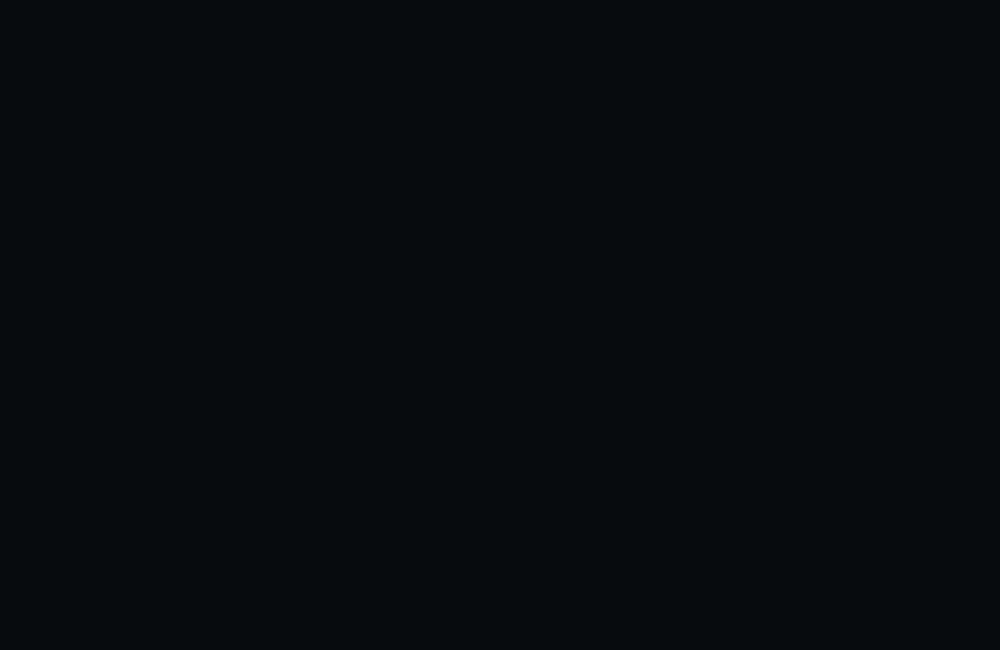

# Flux Files Editor Guide
**Integrated In-Place Text & Document Editing**  
*Quelravo Systems • Fast. Local. Private. Simple.*

---

Flux Files includes lightweight, highly responsive built-in editors for modifying code, documentation, data, and configuration files directly in place. You no longer need to switch focus to a separate heavyweight editor for quick edits, configuration tweaks, or document updates.

---

## 1. Quick Text & Code Editor

### Launching the Editor
Select any text, code, or configuration file in the explorer and press **`Ctrl+E`**, or right-click and choose **Edit**.

### Key Editing Features
- **Syntactic Highlighting**: Language-aware syntax coloring for JavaScript, TypeScript, Python, Rust, Go, C/C++, HTML, CSS, SQL, shell scripts, and Markdown.
- **Line Numbers & Gutter**: Clear line counting with visual cursor line tracking.
- **Find & Replace**: Press `Ctrl+F` inside the editor to invoke the in-file search and replace widget with regex support.
- **Indentation Controls**: Toggle between 2 spaces, 4 spaces, or hard tabs; smart auto-indent on new line.
- **Undo / Redo**: Multi-level undo history (`Ctrl+Z`) and redo history (`Ctrl+Y` / `Ctrl+Shift+Z`).

---

## 2. Live Synchronized Markdown Editor

### Dual-Pane Live Authoring
When opening a Markdown file (`.md`, `.markdown`) in editor mode, Flux Files presents a split workspace:
1. **Left Pane (Source Editor)**: Write clean Markdown with formatting shortcuts.
2. **Right Pane (Live Render Preview)**: Synchronously renders GitHub Flavored Markdown as you type.

### Live Markdown Capabilities
- **Synchronized Scrolling**: Scrolling through code automatically keeps the rendered preview aligned at the same heading section.
- **Header Outline**: Clickable outline jumps directly to sections in both panes.
- **Table Formatting**: Write markdown tables with instant rendered alignment validation.
- **Checklist Interaction**: Interactive checklist toggles for task list items.

---

## 3. Dirty State Tracking & Safe Atomic Saving

Data integrity is fundamental to Flux Files.

### Unsaved Changes Indicator
The moment you modify a file buffer, a prominent **Dirty State Indicator** (dot badge) appears adjacent to the filename in the editor header, signaling unsaved edits.

### Safe Atomic Saving (`Ctrl+S`)
When you press `Ctrl+S` or click **Save**:
1. Flux Files writes your modified contents to an ephemeral hidden staging file on the same disk volume (e.g. `.filename.tmp`).
2. Once written and verified, Flux Files issues an atomic file system replace operation.
3. This atomic write pattern guarantees that your original file cannot be truncated or corrupted if an unexpected system shutdown or power failure occurs during saving.

### Safe Close Confirmation
If you attempt to close an editor tab, switch directories, or exit the application while dirty modifications remain:
- Flux Files prevents immediate closure and presents an explicit confirmation modal.
- Options: **Save Changes**, **Discard Changes**, or **Cancel**.

---

## 4. Character Encodings & Line Endings

- **Encoding Support**: Defaults to UTF-8 (without BOM). Also supports UTF-8 with BOM, UTF-16 LE/BE, and Windows-1252.
- **Line Ending Normalization**: Accurately detects and preserves Windows CRLF (`\r\n`) and Unix LF (`\n`) line ending conventions without unintended mass conversions.
