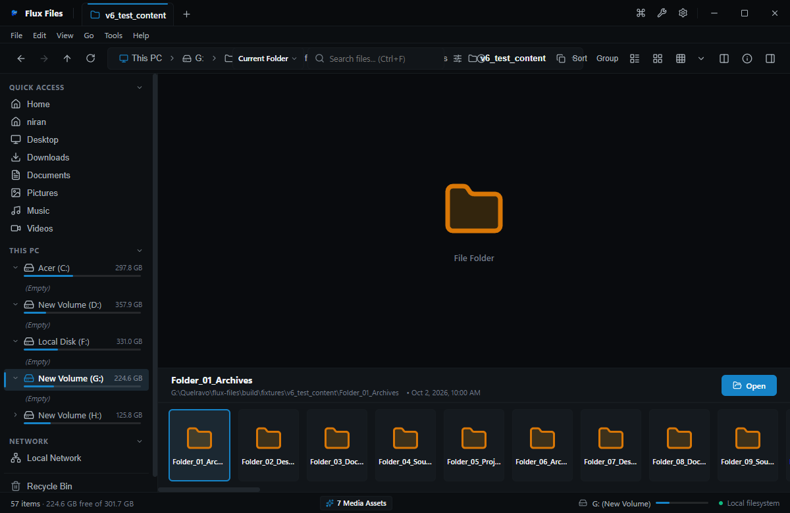
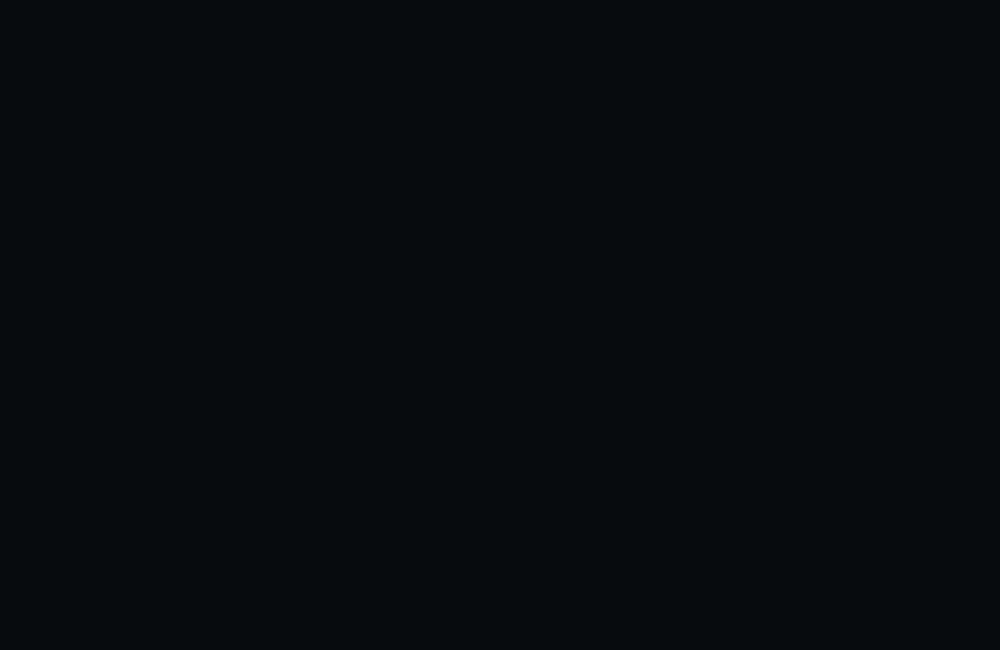

# Flux Files Feature Guide
**Complete Functional Catalog & Technical Reference**  
*Quelravo Systems • Fast. Local. Private. Simple.*

---

This document catalogs every functional capability implemented in Flux Files. Each entry details the feature's purpose, UI access point, operating instructions, key behavior, and authentic UI visual.

---

## 1. Virtual Home Dashboard
- **Purpose**: Unified launchpad displaying storage volume status, quick access paths, and recent activity.
- **Where to Find It**: Left Sidebar top entry or `Alt+Home`.
- **How to Use It**: Click to return to the root overview; click any volume meter to open that drive directly.
- **Important Notes**: Automatically recalculates volume free space on activation.
- **Screenshot**:  

---

## 2. Interactive Breadcrumb Navigation
- **Purpose**: Fast spatial navigation without typing manual path strings.
- **Where to Find It**: Center of the main toolbar.
- **How to Use It**: Click any ancestor segment to ascend to that directory; click arrow chevrons to select sibling folders; press `Ctrl+L` to toggle direct text editing.
- **Important Notes**: Supports copying the full path to clipboard via context menu.
- **Screenshot**:  

---

## 3. Virtualized Details View
- **Purpose**: High-density file listing with sortable column headers and precise metadata.
- **Where to Find It**: Toolbar view button or `Ctrl+Shift+1`.
- **How to Use It**: Click Name, Extension, Size, or Date Modified column headers to sort ascending or descending.
- **Important Notes**: Uses virtual list DOM rendering to handle directories with over 50,000 files at 60 FPS.
- **Screenshot**:  

---

## 4. Gallery View & Media Carousel
- **Purpose**: Dedicated visual asset inspection for photography and design collections.
- **Where to Find It**: Toolbar view button or `Ctrl+Shift+5`.
- **How to Use It**: Displays large hero preview of selected media item with horizontal filmstrip below.
- **Important Notes**: Supports keyboard arrow key traversal for rapid photo culling.
- **Screenshot**:  

---

## 5. Instant In-Folder Search Filter
- **Purpose**: Non-blocking real-time filtering of active folder items.
- **Where to Find It**: Top right toolbar search box or `Ctrl+F`.
- **How to Use It**: Type query characters; non-matching items are hidden immediately without disk re-queries.
- **Important Notes**: Press `Esc` to clear filter and restore full directory display.
- **Screenshot**:  

---

## 6. Everywhere Indexed Global Search
- **Purpose**: Millisecond-level file discovery across all local storage drives.
- **Where to Find It**: Search box globe icon or `Ctrl+Shift+F`.
- **How to Use It**: Enter query term; supports `ext:`, `type:`, and `size:` syntax operators.
- **Important Notes**: Powered by local SQLite index; zero remote network transmission.
- **Screenshot**:  

---

## 7. Universal Markdown Viewer
- **Purpose**: Rich rendered preview of documentation, READMEs, and technical notes.
- **Where to Find It**: Inspector pane on selecting `.md` files or pressing `Spacebar`.
- **How to Use It**: Renders headers, code blocks with syntax coloring, checklists, and tables.
- **Important Notes**: Pure local parser with zero external CDN asset fetching.
- **Screenshot**:  

---

## 8. Tabular CSV/TSV Data Viewer
- **Purpose**: High-speed table inspection for structured data files without launching spreadsheet software.
- **Where to Find It**: Inspector pane on selecting `.csv` or `.tsv` files.
- **How to Use It**: Scroll through rows with fixed headers, resize columns, and sort by column data.
- **Important Notes**: Auto-detects delimiters (comma, tab, semicolon, pipe).
- **Screenshot**:  

---

## 9. Binary Hexadecimal Inspector
- **Purpose**: Low-level forensic and reverse-engineering byte analysis.
- **Where to Find It**: Inspector pane for binary files or `Open in Hex Viewer` context menu.
- **How to Use It**: Inspect 16-byte hex dump alongside ASCII translation column and byte offsets.
- **Important Notes**: Streams large multi-gigabyte binaries efficiently via chunking.
- **Screenshot**:  

---

## 10. Live Synchronized Markdown Editor
- **Purpose**: Edit Markdown documentation with real-time synchronized HTML preview.
- **Where to Find It**: Context menu `Edit` or `Ctrl+E` on `.md` files.
- **How to Use It**: Edit text on left; live preview renders synchronously on right. Save with `Ctrl+S`.
- **Important Notes**: Features atomic safe saving to prevent data corruption.
- **Screenshot**:  

---

## 11. Virtual Archive Browser
- **Purpose**: Traverse compressed archives transparently without manual pre-extraction.
- **Where to Find It**: Double-click any `.zip`, `.tar`, `.tar.gz`, or `.7z` file.
- **How to Use It**: Browse directory hierarchies, view compression ratios, and preview enclosed documents.
- **Important Notes**: Memory-efficient virtual tree construction.
- **Screenshot**:  

---

## 12. Batch Rename Power Tool
- **Purpose**: Bulk renaming of file batches with regex, find/replace, case shifts, and numbering.
- **Where to Find It**: `Tools > Batch Rename` or `Ctrl+Shift+R`.
- **How to Use It**: Select files, choose rule type, adjust parameters, verify live preview table, and click Apply.
- **Important Notes**: Validates target names for Windows filename illegal character collisions before execution.
- **Screenshot**:  

---

## 13. Dual-Pane Split Workspace
- **Purpose**: Simultaneous side-by-side directory management for power file transfers.
- **Where to Find It**: Toolbar split icon or `Ctrl+Alt+2`.
- **How to Use It**: Manage two distinct browsing contexts; drag items between panes to copy or move.
- **Important Notes**: Preserves distinct path histories for both panes.
- **Screenshot**:  

---

## 14. Theme & Appearance Engine
- **Purpose**: Ergonomic workspace customization with dark and light themes and density scaling.
- **Where to Find It**: `Settings > Appearance` or `Ctrl+,`.
- **How to Use It**: Select Dark, Light, or System theme; adjust display density between Compact and Comfortable.
- **Important Notes**: Themes apply instantly without application restart.
- **Screenshot**:  

