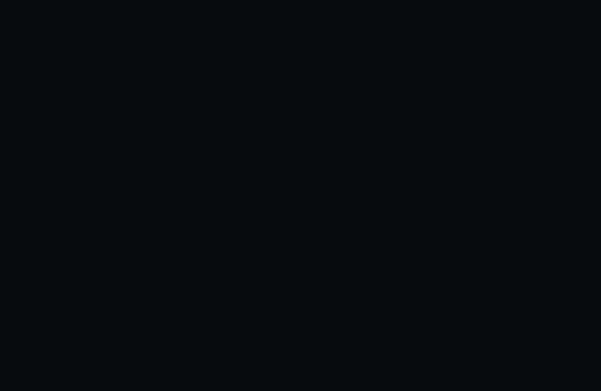

# Flux Files Menu Reference
**Comprehensive Menu Bar & Context Command Hierarchy**  
*Quelravo Systems • Fast. Local. Private. Simple.*

---

Flux Files features a structured native desktop menu bar alongside intuitive contextual menus. This reference documents every command, submenu, keyboard accelerator, and functional behavior.

---

## 1. File Menu (`Alt+F`)

| Command | Submenu | Shortcut | Behavior |
|---|---|---|---|
| **New Tab** | — | `Ctrl+T` | Opens a new browsing tab in the active pane. |
| **Close Tab** | — | `Ctrl+W` | Closes the currently active tab. |
| **New Folder** | — | `Ctrl+Shift+N` | Prompts for folder name and creates directory at active path. |
| **New File** | — | `Ctrl+Alt+N` | Prompts for file name/extension and creates blank file. |
| **Open in Terminal** | — | `Ctrl+`` | Launches Windows Terminal or PowerShell rooted at current directory. |
| **Properties** | — | `Alt+Enter` | Displays detailed file/folder properties and attributes dialog. |
| **Exit** | — | `Alt+F4` | Saves current workspace session and closes Flux Files cleanly. |

---

## 2. Edit Menu (`Alt+E`)

| Command | Submenu | Shortcut | Behavior |
|---|---|---|---|
| **Cut** | — | `Ctrl+X` | Stages selected items to clipboard for moving. |
| **Copy** | — | `Ctrl+C` | Stages selected items to clipboard for duplication. |
| **Copy Path** | — | `Ctrl+Shift+C` | Copies absolute Windows file path(s) to clipboard as text. |
| **Paste** | — | `Ctrl+V` | Executes staged move or copy into the active directory. |
| **Duplicate** | — | `Ctrl+D` | Immediately clones selected items in place with numbering. |
| **Select All** | — | `Ctrl+A` | Selects all files and folders in current directory view. |
| **Invert Selection** | — | `Ctrl+Shift+I` | Deselects active items and selects all unselected items. |
| **Rename** | — | `F2` | Initiates in-place renaming of selected item. |
| **Delete** | — | `Delete` | Safely moves selected items to Windows Recycle Bin. |
| **Permanent Delete** | — | `Shift+Delete` | Permanently erases items from disk after safety confirmation. |

---

## 3. View Menu (`Alt+V`)

| Command | Submenu | Shortcut | Behavior |
|---|---|---|---|
| **Details View** | Layout | `Ctrl+Shift+1` | Switches explorer viewport to sortable multi-column table. |
| **List View** | Layout | `Ctrl+Shift+2` | Switches to high-density compact multi-column list. |
| **Grid View** | Layout | `Ctrl+Shift+3` | Switches to medium thumbnail icon card layout. |
| **Large Grid View** | Layout | `Ctrl+Shift+4` | Switches to large icon card layout. |
| **Gallery View** | Layout | `Ctrl+Shift+5` | Switches to media hero preview with carousel strip. |
| **Toggle Split View** | Workspace | `Ctrl+Alt+2` | Toggles dual side-by-side browsing panes. |
| **Toggle Inspector** | Panels | `Spacebar` | Opens or collapses right-side preview/details panel. |
| **Show Hidden Files** | Display | `Ctrl+H` | Toggles display of hidden files and folders. |
| **Refresh** | — | `F5` / `Ctrl+R` | Re-enumerates active filesystem directory from disk. |

---

## 4. Go / Navigation Menu (`Alt+G`)

| Command | Submenu | Shortcut | Behavior |
|---|---|---|---|
| **Back** | Travel | `Alt+Left` | Returns to previous directory in browsing history. |
| **Forward** | Travel | `Alt+Right` | Advances to next directory in history. |
| **Up to Parent** | Travel | `Alt+Up` / `Backspace` | Ascends to parent directory on disk. |
| **Focus Address Bar** | Focus | `Ctrl+L` / `Alt+D` | Activates editable text address bar. |
| **Virtual Home** | Places | `Alt+Home` | Navigates to virtual home dashboard. |
| **This PC** | Places | `Ctrl+Shift+E` | Navigates to root drives and mounted volume listing. |

---

## 5. Tools Menu (`Alt+T`)

| Command | Submenu | Shortcut | Behavior |
|---|---|---|---|
| **Batch Rename** | Power Tools | `Ctrl+Shift+R` | Opens multi-file regex/pattern renaming modal. |
| **Storage Analyzer** | Power Tools | `Ctrl+Shift+S` | Opens volume storage intelligence pane. |
| **Duplicate Finder** | Power Tools | `Ctrl+Shift+D` | Opens duplicate file identification utility. |
| **Compress Selection** | Archives | `Ctrl+Shift+Z` | Opens archive creation dialog for selected items. |
| **Extract Archive** | Archives | `Ctrl+Shift+X` | Decompresses selected archive to disk. |
| **Settings** | — | `Ctrl+,` | Opens application settings modal. |

---

## 6. Help Menu (`Alt+H`)

| Command | Submenu | Shortcut | Behavior |
|---|---|---|---|
| **User Handbook** | Documentation | `F1` | Opens Flux Files User Handbook documentation. |
| **Keyboard Shortcuts** | Documentation | `Ctrl+/` | Displays master keyboard shortcut reference modal. |
| **Check for Updates** | Maintenance | — | Queries update server for new releases (opt-in). |
| **About Flux Files** | — | — | Displays version, build hash, architecture, and license. |
