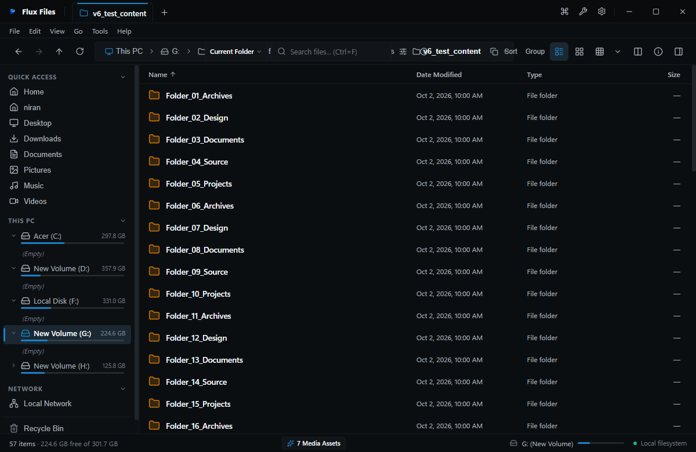
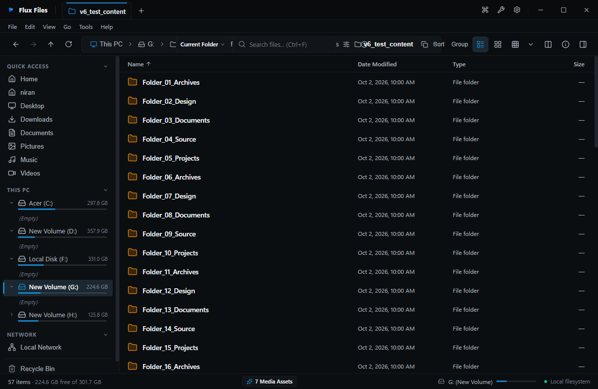
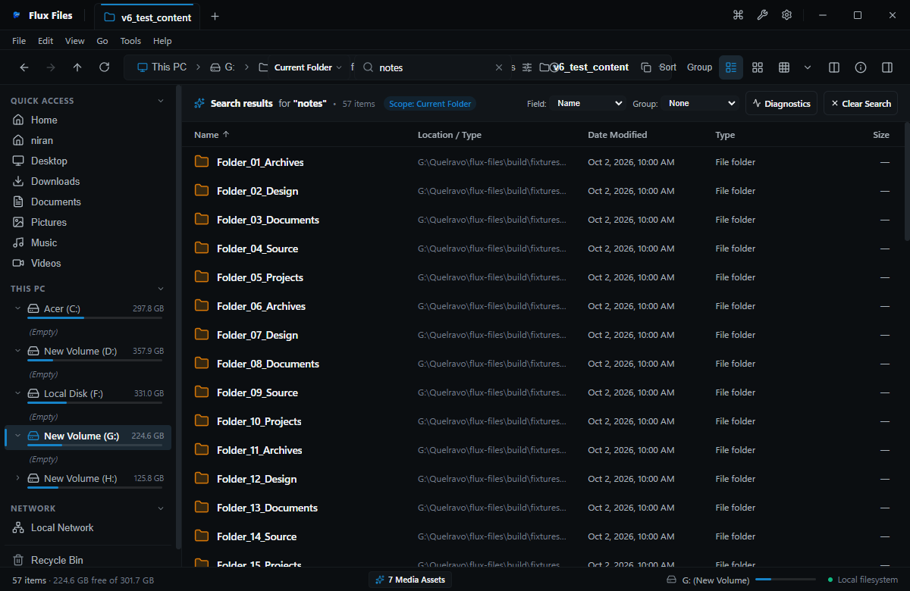
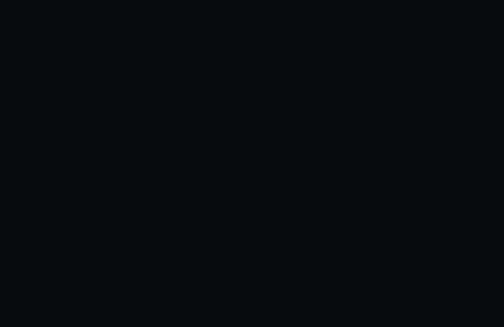

# Flux Files Quick Start Guide
**Rapid Setup & Essential Workflows**  
*Quelravo Systems • Fast. Local. Private. Simple.*

---

Welcome to Flux Files! This visual quick-start guide walks you through the 10 fundamental steps to master your new file manager in under five minutes.

---

## Step 1: Install & Launch
Run `Flux-Files-Setup-1.0.0.exe` and launch Flux Files. The application launches immediately into the Virtual Home workspace.

---

## Step 2: Navigate Storage
Use the **Left Sidebar** to access your mounted drives, standard libraries, or pinned folders. Double-click folders to open them, or use the **Interactive Breadcrumbs** to jump to any parent level instantly.

---

## Step 3: Choose Your Preferred View
Click the view mode icons in the toolbar to switch layout on the fly:
- **Details View** (`Ctrl+Shift+1`) for sorting by size and date.
- **List View** (`Ctrl+Shift+2`) for scanning long directories.
- **Grid View** (`Ctrl+Shift+3`) for clean icon and thumbnail browsing.
- **Gallery View** (`Ctrl+Shift+5`) for photo and asset collections.

---

## Step 4: Rapid Keyboard Navigation
- `Enter`: Open highlighted folder or file.
- `Backspace` or `Alt+Up`: Move up to parent directory.
- `Alt+Left` / `Alt+Right`: Historical back and forward navigation.
- `Ctrl+L`: Jump directly to address bar text input.

---

## Step 5: Master File Operations
- `Ctrl+Shift+N`: Create a new folder.
- `Ctrl+C` / `Ctrl+X` / `Ctrl+V`: Standard copy, cut, and paste.
- `Ctrl+D`: Immediate in-place duplication.
- `F2`: In-place item renaming.
- `Delete`: Send to Recycle Bin safely.

---

## Step 6: High-Speed Instant Search
Press `Ctrl+F` to filter the active folder instantly as you type. Press `Ctrl+Shift+F` to unleash **Everywhere Search** across all indexed local storage with instant matching.

---

## Step 7: Spacebar Quick Previews
Highlight any file and press **Spacebar** to toggle the built-in inspector. Preview Markdown, JSON, CSV tables, PDFs, images, and audio waveforms without launching third-party apps.

---

## Step 8: Edit Files in Place
Highlight any code or text file and press `Ctrl+E`. Modify content directly in the lightweight built-in editor and press `Ctrl+S` for safe atomic disk saving.

---

## Step 9: Power Multi-Tasking with Split View
Press `Ctrl+Alt+2` to split your workspace into **Dual-Pane View**. Easily compare directories or drag and drop files across panes without opening extra windows.

---

## Step 10: Unleash Power Tools
Select multiple files and press `Ctrl+Shift+R` to open **Batch Rename**, or select an archive and press `Ctrl+Shift+X` to extract it with multi-threaded performance.

---
*For in-depth explanations, consult the full [FLUX-FILES-USER-HANDBOOK.md](FLUX-FILES-USER-HANDBOOK.md).*
