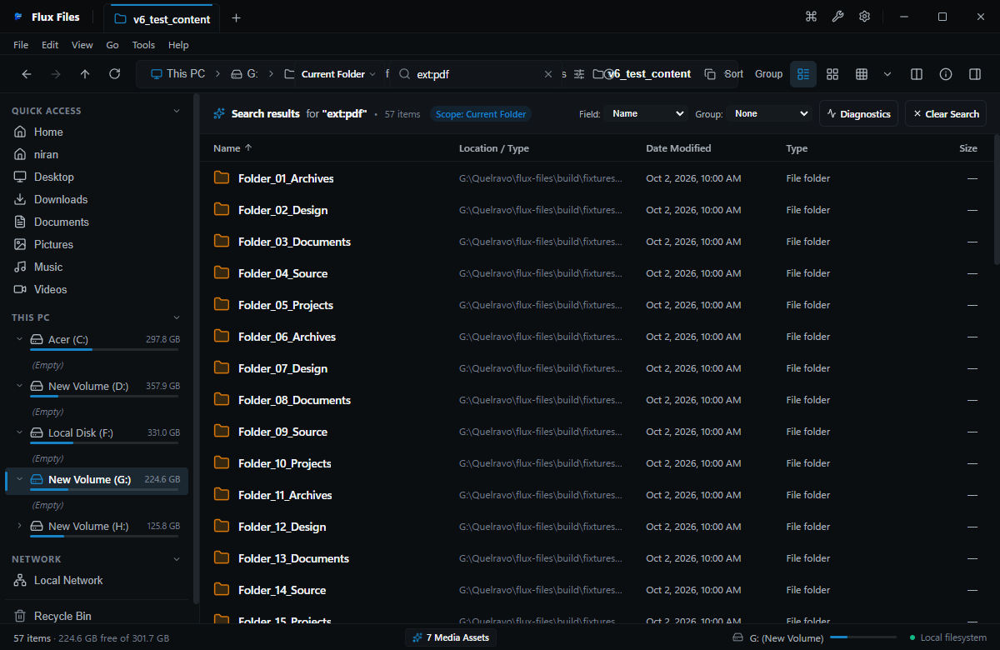

# Flux Files Search Guide
**Instant Directory Filtering & High-Speed Indexed Discovery**  
*Quelravo Systems • Fast. Local. Private. Simple.*

---

Flux Files features a two-tiered search architecture designed to deliver sub-millisecond query results whether you are locating a file within a dense folder or searching across multiple physical drives.

---

## 1. Instant In-Folder Filter

### Real-Time In-Memory Filtering
- **Activation**: Click the search input in the toolbar or press **`Ctrl+F`**.
- **Operation**: As you type, the explorer view dynamically filters the active folder contents.
- **Performance**: Instantaneous 0ms latency because filtering occurs strictly within local memory without issuing new disk read requests.
- **Clearing**: Press **`Esc`** to clear the search query and restore the full directory display.

---

## 2. Everywhere Global Search

### Deep Filesystem Discovery
- **Activation**: Press **`Ctrl+Shift+F`** or click the Globe icon in the search box.
- **Operation**: Queries the local SQLite index across all indexed storage volumes.
- **Presentation**: Results display matching item names, full directory paths, byte sizes, and modification dates.
- **Actions**:
  - Double-click any result to open it directly.
  - Right-click and select **Open Containing Folder** to jump directly to the parent directory with the target file highlighted.

---

## 3. Search Syntax & Filter Operators

Flux Files supports specialized query prefix operators for precise results:

### Extension Filtering (`ext:`)
- `ext:pdf` — Only matches PDF documents.
- `ext:png,jpg` — Matches PNG or JPEG image files.
- `report ext:docx` — Finds files containing "report" with a `.docx` extension.

### Categorical Type Filtering (`type:`)
- `type:image` — Matches all image formats (`.png`, `.jpg`, `.webp`, `.svg`, etc.).
- `type:video` — Matches video media files (`.mp4`, `.webm`, `.mkv`, `.mov`).
- `type:audio` — Matches audio tracks (`.mp3`, `.wav`, `.flac`, etc.).
- `type:code` — Matches source code files (`.ts`, `.js`, `.py`, `.rs`, `.cpp`, etc.).
- `type:archive` — Matches compressed archives (`.zip`, `.tar`, `.7z`, `.gz`).
- `type:document` — Matches office and portable documents (`.pdf`, `.docx`, `.xlsx`, `.txt`).

### Size Constraints (`size:`)
- `size:>500MB` — Finds items larger than 500 Megabytes.
- `size:<10KB` — Finds tiny files under 10 Kilobytes.
- `size:10MB..50MB` — Matches files within an explicit size range.

### Exact Phrases & Wildcards
- `"quarterly financial audit"` — Enclose search terms in quotes to match exact contiguous character sequences.
- `budget_202?.*` — Question mark (`?`) matches single arbitrary characters; asterisk (`*`) matches multiple arbitrary characters.
