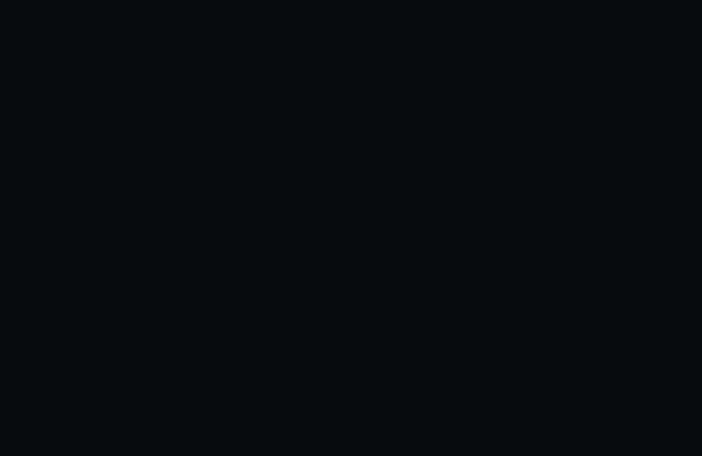
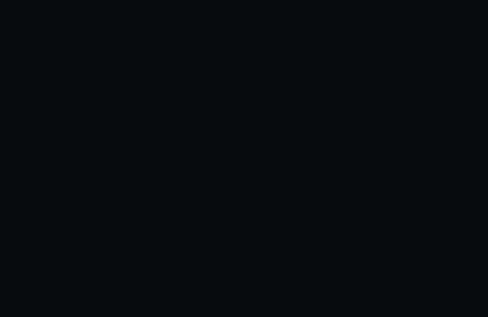
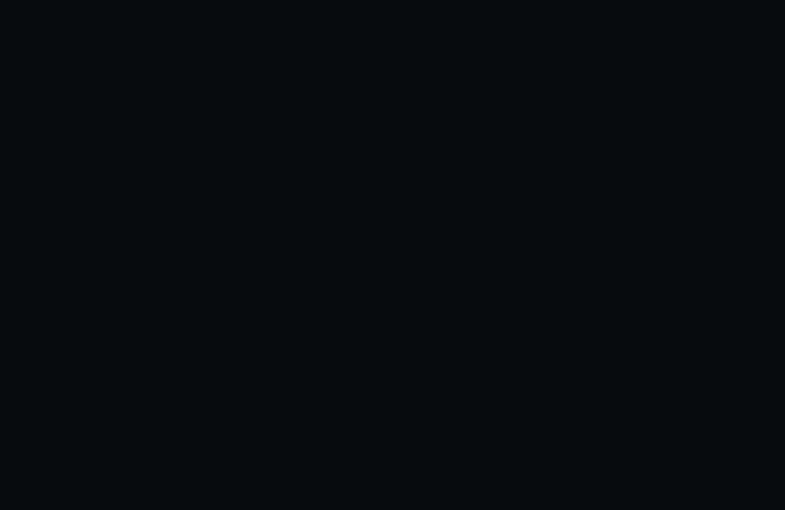

# Flux Files Settings Guide
**Complete System Configuration & Preferences Manual**  
*Quelravo Systems • Fast. Local. Private. Simple.*

---

Flux Files provides an exhaustive, granular settings system allowing you to tune performance, presentation, and operational safety to your exact requirements.

To open Settings:
- Press **`Ctrl+,`** at any time.
- Or select **`Tools > Settings`** from the global menu bar.

---

## 1. General Settings

### Configuration Options
- **Startup Location**:
  - *Virtual Home* (Default): Launches into the central system overview and volume summary.
  - *This PC*: Launches displaying root storage drives and volumes.
  - *Restore Previous Session*: Reopens the exact tabs, paths, and split pane state active when last closed.
  - *Custom Path*: Specify an absolute directory path to always open on launch.
- **Single-Click vs Double-Click to Open**:
  - *Double-Click* (Default): Traditional Windows Explorer interaction (single click selects, double click opens).
  - *Single-Click*: Web-style navigation (hover selects, single click opens).
- **Deletion Confirmations**:
  - *Always Prompt* (Recommended): Displays a confirmation modal before permanent deletion operations.
  - *Direct Delete*: Immediately erases permanently without modal prompt when `Shift+Delete` is pressed.

---

## 2. Appearance & Theming Settings

### Visual Configuration
- **Application Theme**:
  - **Dark Theme**: Deep neutral charcoal backgrounds (#121214) with subtle slate borders and high contrast text. Reduces eye fatigue during extended use.
  - **Light Theme**: Crisp paper-white backgrounds with soft gray boundaries and balanced contrast.
  - **Follow Windows System**: Automatically transitions between Light and Dark themes when your Windows system theme shifts.
- **Display Density**:
  - **Compact**: 24px row heights. Maximizes the number of visible files per screen. Ideal for professional directories with high item counts.
  - **Standard** (Default): 32px row heights. Balanced touch-and-click targets.
  - **Comfortable**: 40px row heights. Spacious presentation with larger icons.
- **Interface Font Size**:
  - Scale typography between 11px and 16px to match high-DPI displays or personal accessibility needs.
- **UI Animations**:
  - Toggle smooth CSS transitions on or off. Disabling animations provides instant zero-latency UI updates on lower-spec hardware.

---

## 3. Files & Directory Settings

### File Display Options
- **Show Hidden Files & Folders (`Ctrl+H`)**:
  - Toggles whether items with the Windows `FILE_ATTRIBUTE_HIDDEN` attribute are rendered in the explorer view (displayed with semi-transparent icons).
- **Show Protected Operating System Files**:
  - Protects against accidental tampering with Windows system files. Disabled by default.
- **Show File Name Extensions**:
  - When enabled, full extensions (e.g. `.png`, `.docx`) are always rendered in item names.
- **Show Checkboxes on Items**:
  - Displays persistent multi-select checkboxes next to item names for easy touch or single-click batch selections.

---

## 4. Search & Indexing Settings

### Indexing Engine Controls
- **Search Provider**:
  - *High-Speed Local Index* (Default): Uses the background SQLite engine for millisecond query responses.
  - *Real-Time Disk Walk*: Bypasses index; traverses file system trees on the fly.
- **Monitored Storage Volumes**:
  - Add or remove specific folders and drives from the background indexing engine.
- **Ignored Directory Patterns**:
  - Configurable glob list of folders excluded from indexing: `node_modules`, `.git`, `target`, `dist`, `AppData`, `$Recycle.Bin`.
- **Rebuild Index**:
  - Click to clear and regenerate the local SQLite search index from scratch.

---

## 5. Updates & About

### Maintenance & Release Integrity
- **Check for Updates Button**:
  - Manually checks the official release endpoint for newly published versions.
  - Flux Files **never** performs automatic background downloads or silent installs.
- **Version & Build Information**:
  - Displays active semantic version (v1.0.0), build date, Node/Electron runtime versions, and commit SHA.
