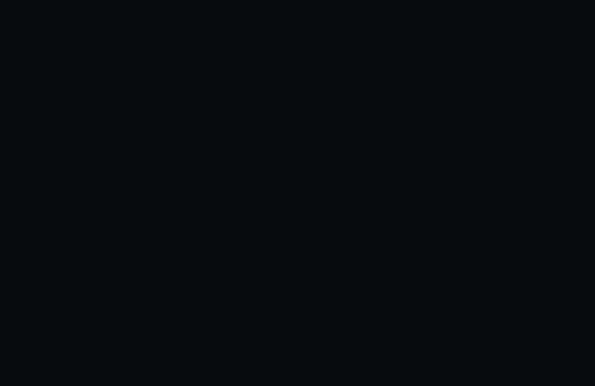
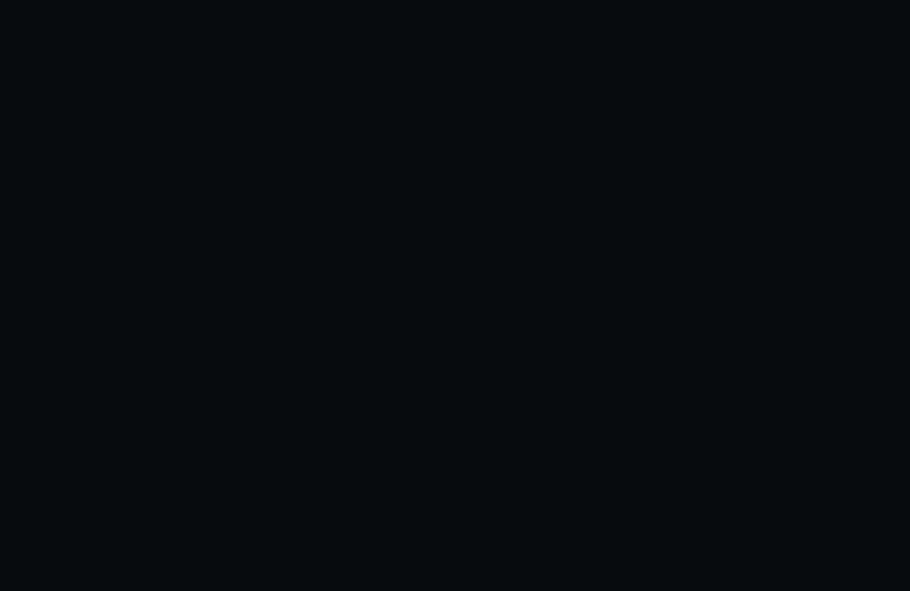

# Flux Files Troubleshooting & Diagnostics
**Practical Solutions for Real Operating Scenarios**  
*Quelravo Systems • Fast. Local. Private. Simple.*

---

This guide provides practical, actionable resolutions for technical issues, permissions conflicts, and performance bottlenecks that may arise during heavy filesystem operations.

---

## 1. Access Denied & Inaccessible Paths

### Symptom
A red notification or status banner appears reading "Access Denied: Inaccessible Path" when attempting to navigate into a folder.

### Cause
Windows User Account Control (UAC) or NTFS Access Control Lists (ACLs) restrict standard user accounts from accessing protected directories (e.g. `C:\System Volume Information`, `C:\Recovery`, or another user's private profile).

### Resolution
1. Verify if you have administrative privileges on the current Windows account.
2. If necessary, close Flux Files, right-click its desktop shortcut, and select **Run as administrator**.
3. Verify folder permissions in Windows: right-click the folder in Windows Explorer > Properties > Security tab > ensure your user account has Read permissions.

---

## 2. Everywhere Search Returns Zero Matches

### Symptom
Typing a search term in Everywhere Search (`Ctrl+Shift+F`) yields no matching files even though the files are known to exist on disk.

### Cause
- The directory containing the target files may be excluded from the index.
- An active filter operator (e.g. `ext:pdf`) is restricting the results.
- The background SQLite search index may need to be updated.

### Resolution
1. Clear all search tokens and type solely the raw filename keyword.
2. Navigate to **`Settings > Search`** (`Ctrl+,`).
3. Verify that the target drive or folder is checked under **Monitored Storage Volumes**.
4. Click **Rebuild Index** to refresh the index database from disk.

---

## 3. File Is Locked by Another Process

### Symptom
Attempting to rename, move, or delete a file triggers a notification: *"The file cannot be modified because it is currently in use by another process."*

### Cause
Another application (such as Visual Studio Code, Excel, or a running command-line process) holds an active write or shared lock on the target file.

### Resolution
1. Identify and close the active application holding the open file handle.
2. In Flux Files, press **`F5`** to refresh the directory state, then retry the operation.

---

## 4. Resetting Flux Files Configuration

### Symptom
You wish to revert custom appearance, density, or navigation settings back to factory defaults.

### Resolution
1. Exit Flux Files completely (`Alt+F4`).
2. Open Windows Run dialog (`Win+R`) and type:
   `%APPDATA%\Flux Files`
3. Rename or delete the file named `config.json`.
4. Relaunch Flux Files. Pristine default preferences will be generated automatically.
