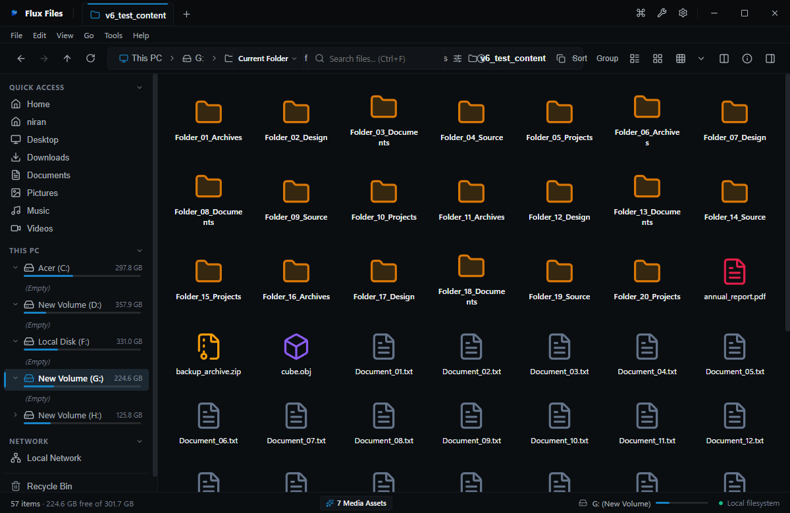
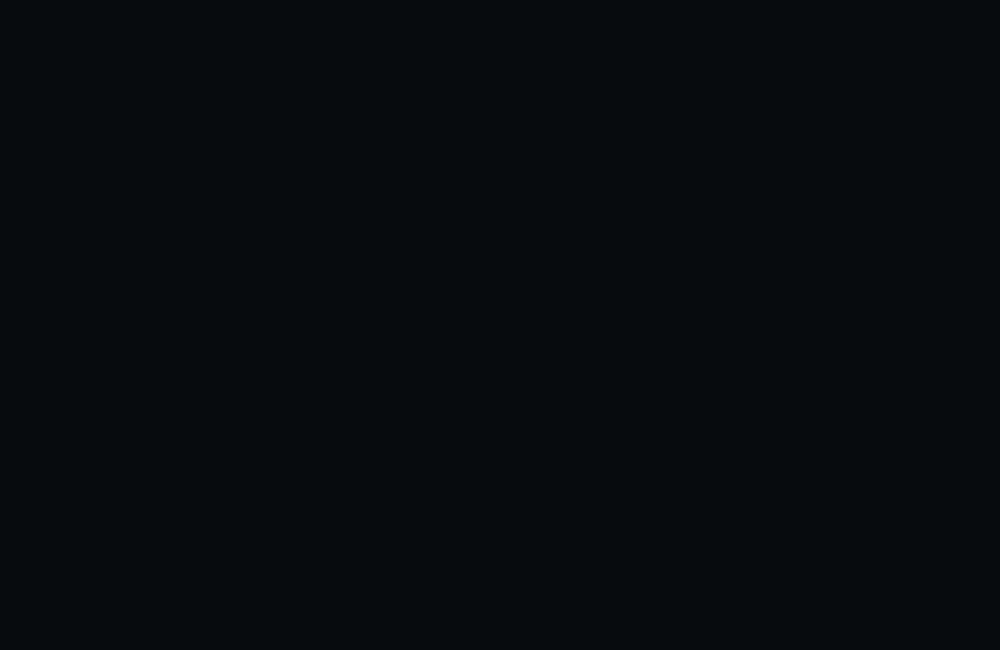
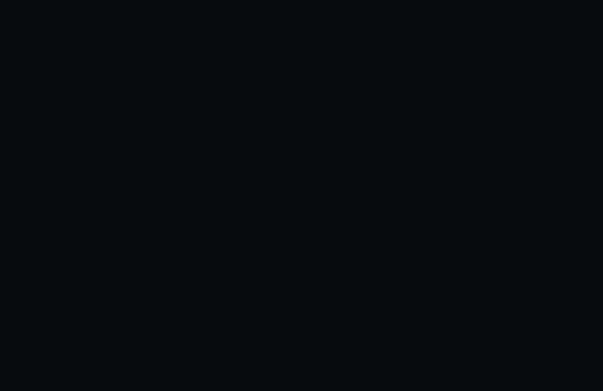
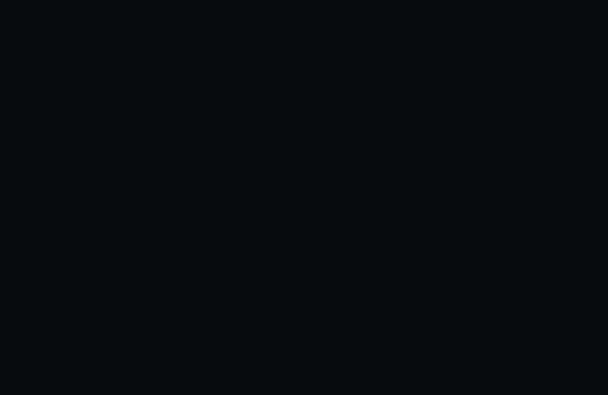
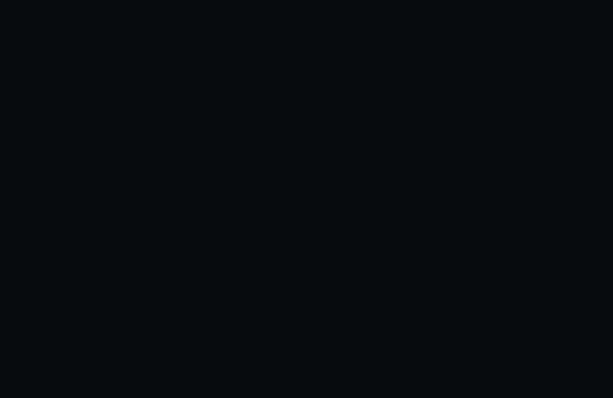

# Flux Files User Handbook
**Official Comprehensive User Guide & System Manual**  
*Quelravo Systems • Fast. Local. Private. Simple.*

---

## 1. Introduction

Flux Files is a high-performance desktop file manager and storage inspection environment designed specifically for Windows. Modern operating system file managers frequently suffer from sluggish directory enumeration, heavy background telemetry, fragmented third-party preview tools, and clunky modal workflows. Flux Files re-engineers daily filesystem interactions from the ground up to deliver a unified, zero-latency desktop environment.

### Who Flux Files Is For
- **Power Users & Developers**: Users managing dense source code repositories, multi-gigabyte builds, heterogeneous asset directories, and command-line workflows.
- **Digital Creators & Media Producers**: Photographers, audio engineers, and 3D artists who require immediate inline previews, metadata inspection, and instant visual verification without launching separate resource-heavy creative suites.
- **Enterprise & Privacy-Conscious Professionals**: Engineers and researchers demanding strict local autonomy, airtight compliance, zero outbound network telemetry, and robust data integrity.

### Core Philosophy
- **FAST**: Asynchronous file system access, virtualized list rendering, immediate multi-threaded search indexing, and rapid caching architectures ensure directory lists load instantly even with tens of thousands of items.
- **LOCAL**: Operating entirely on your PC. No third-party accounts, no remote subscriptions, and zero cloud lock-in.
- **PRIVATE**: Absolute local confidentiality. No analytics beacons, no path tracking, no cloud telemetry.
- **SIMPLE**: Clean Fluent-inspired interface that prioritizes keyboard flow, intuitive spatial navigation, and distraction-free file manipulation.

---

## 2. Getting Started

### Installation & System Requirements
Flux Files runs natively on 64-bit Windows systems (Windows 10 and Windows 11). It is distributed as a zero-dependency installer (`Flux-Files-Setup-1.0.0.exe`) or a standalone portable executable package.

1. Download the verified installer package from the official distribution channel.
2. Run `Flux-Files-Setup-1.0.0.exe`. The setup initializes the necessary system associations without installing extraneous adware or kernel drivers.
3. Upon completion, launch Flux Files from your Start Menu, desktop shortcut, or by executing `flux-files` via Windows Terminal or PowerShell.

### First Launch & Initial Interface

When you launch Flux Files for the first time, you are presented with the primary workspace:
- The **Top Header Bar** displays your current tabs, new tab button, and standard window controls.
- The **Navigation Toolbar** displays historic travel arrows (Back, Forward, Up), an interactive breadcrumb address bar, an instant search bar, and view mode selector icons.
- The **Sidebar** presents quick navigation categories including Virtual Home, This PC, connected storage drives, and bookmarked directories.
- The **Central Workspace** renders the contents of the active location with fluid sorting and selection mechanics.
- The **Status Bar** at the bottom right reports item count, selected item count, and aggregate selection byte sizes in real time.

### Opening Folders & Basic Navigation
1. **Navigating into Folders**: Double-click any folder row or icon in the central view. Alternatively, highlight a folder with your arrow keys and press `Enter`.
2. **Ascending to Parent**: Click the **Up** arrow in the toolbar, press `Alt+Up`, or press `Backspace`.
3. **Using Breadcrumbs**: Click any ancestor segment directly in the address bar to jump back immediately to that directory level.

### Selecting Files
- **Single File**: Click any file to select it.
- **Range Selection**: Click the first item, hold `Shift`, and click the final item in the sequence.
- **Discontinuous Selection**: Hold `Ctrl` while clicking individual items to toggle their selection state.
- **Invert Selection**: Select menu `Edit > Invert Selection` or press `Ctrl+Shift+I` to reverse the current selection.

---

## 3. Understanding the Interface

The Flux Files workspace is partitioned into distinct functional regions designed for high spatial efficiency:

1. **Tab Strip (Top)**: Houses active browsing contexts. You can create multiple tabs (`Ctrl+T`), close active tabs (`Ctrl+W`), pin priority locations, or split your view into dual side-by-side panes.
2. **Global Menu Bar**: Native application controls for deep file operations, view mode adjustments, tools invocation, and diagnostic help.
3. **Navigation & Breadcrumb Bar**: Shows your active path hierarchy with interactive clickable tokens and a one-click manual path entry mode (`Ctrl+L`).
4. **Instant Search Box**: Real-time filtering and globally indexed filesystem discovery input (`Ctrl+F`).
5. **Left Sidebar**: Quick-access tree presenting system roots, fixed drives, removable drives, and customizable pinned paths.
6. **Central Explorer Grid / Table**: The virtualized primary presentation viewport featuring 8 layout styles with rapid keyboard navigation.
7. **Inspector / Details Pane**: Right-docked contextual panel offering instant document previews, hex dumps, media playback, and filesystem metadata.
8. **Bottom Status Strip**: Instant metrics detailing total directory items, active selection count, total byte size, and search engine status.

---

## 4. Navigation

### The Navigation Sidebar
The left sidebar provides instant anchors to essential physical and virtual storage targets:
- **Virtual Home**: A consolidated control center showing frequently accessed directories, recent items, and storage utilization gauges.
- **This PC**: Lists all mounted Windows volumes (`C:\`, `D:\`, mapped network drives, USB storage) accompanied by capacity meters and volume labels.
- **Standard User Libraries**: Direct shortcuts to Desktop, Documents, Downloads, Pictures, Videos, and Music.
- **Pinned Locations**: Your customizable quick-access bookmarks. Right-click any folder and select **Pin to Sidebar** to establish a persistent anchor.

### Address & Navigation Bar

The address bar operates in two complementary modes:
- **Interactive Breadcrumb Mode**: Each path component is an independent clickable pill. Clicking any segment instantly transitions the workspace to that ancestor directory. Clicking the chevron delimiter adjacent to a directory displays a drop-down menu of sibling folders.
- **Direct Path Entry Mode**: Press `Ctrl+L` or `Alt+D` or click directly in empty address bar whitespace to transform breadcrumbs into an editable text field. You can paste absolute Windows file paths, environment variables (e.g., `%APPDATA%`), or UNC network paths (e.g., `\\Server\Share`) and press `Enter` to navigate.

### Tabbed Browsing

Flux Files supports multi-tab browsing:
- **New Tab**: Click the `+` button or press `Ctrl+T` to open a new tab defaulting to your configured start location.
- **Close Tab**: Click the `x` on the tab header or press `Ctrl+W`.
- **Switch Tabs**: Click the tab header or press `Ctrl+Tab` / `Ctrl+Shift+Tab` to cycle forwards and backwards.
- **Pin Tab**: Right-click a tab header and select **Pin Tab** to shrink it into an icon-only persistent anchor that cannot be accidentally closed.

---

## 5. Explorer Views

Flux Files provides multiple specialized view modes to suit different workflows and file types:

### Details View

- **Best For**: General administration, file sorting, and precise metadata analysis.
- **Displayed Columns**: Name, File Extension, Size, Date Modified, Date Created, and Attributes.
- **Activation**: Click the Details icon in the toolbar or press `Ctrl+Shift+1`.
- **Features**: Sort by any column by clicking the column header. Click again to invert sort order.

### List View

- **Best For**: Rapid scanning of dense directories containing thousands of files.
- **Displayed Information**: Compact icon and filename arranged in efficient multi-column flow.
- **Activation**: Click the List icon in the toolbar or press `Ctrl+Shift+2`.

### Grid Views (Compact, Medium, Large, Extra Large)

- **Best For**: Visual scanning, documents, project folders, and general desktop organization.
- **Displayed Information**: High-resolution thumbnail preview, centered item label, and size badge.
- **Activation**: Click the Grid icon or press `Ctrl+Shift+3` (Medium) or `Ctrl+Shift+4` (Large).

### Gallery View

- **Best For**: Photography collections, graphic design assets, and video libraries.
- **Displayed Information**: Large centered hero preview with a horizontal carousel strip of sibling images along the bottom.
- **Activation**: Click the Gallery icon or press `Ctrl+Shift+5`.

---

## 6. File Operations

Flux Files provides high-speed, non-blocking asynchronous file operations with background queue management.

### Creating Files & Folders
- **New Folder**: Press `Ctrl+Shift+N` or click `File > New Folder`. A modal dialog allows you to enter the directory name.
- **New File**: Press `Ctrl+Alt+N` or click `File > New File`. Specify the file name and extension (e.g. `notes.md`, `script.py`).

### Copy, Cut & Paste
- **Copy**: Select items and press `Ctrl+C` or choose **Copy** from the context menu.
- **Cut (Move)**: Select items and press `Ctrl+X` or choose **Cut**.
- **Paste**: Navigate to the target directory and press `Ctrl+V` or choose **Paste**.
- **Duplicate**: Select items and press `Ctrl+D` to generate an immediate duplicate copy in place with auto-incremented numbering.

### Renaming
- Select an item and press `F2` or choose **Rename** from the context menu. Type the new name and press `Enter` to commit, or `Esc` to cancel.
- For bulk renaming across multiple files, use the integrated **Batch Rename Power Tool** (`Ctrl+Shift+R`).

### Deletion & Recycle Bin Safety

- **Safe Delete (Recycle Bin)**: Select items and press `Delete`. Files are moved safely to the Windows Recycle Bin, allowing complete restoration if needed.
- **Permanent Delete**: Press `Shift+Delete`. A safety confirmation modal appears warning that this operation permanently erases selected items from disk without staging in the Recycle Bin.

---

## 7. Search

Flux Files features an integrated high-speed search engine supporting both instant in-directory filtering and indexed system-wide discovery.

### Instant In-Folder Filter
When you type into the search box in the top-right toolbar (or press `Ctrl+F`), Flux Files filters the active directory in real time without querying the disk. Filtering happens instantaneously as you type each keystroke.

### Everywhere Search & Indexing

- Press `Ctrl+Shift+F` or click the globe icon in the search box to trigger **Everywhere Search**.
- Flux Files leverages an embedded local SQLite index to locate matching files across indexed volumes in milliseconds.
- Search results display full matching paths, parent folders, match highlights, and size indicators.

### Search Filter Syntax

You can refine search queries using powerful prefix operators:
- `ext:pdf` or `ext:png` — Restricts matches to specific file extensions.
- `type:image`, `type:video`, `type:audio`, `type:code`, `type:archive` — Categorical filtering.
- `size:>100MB` or `size:<1GB` — Size threshold constraints.
- `"exact phrase"` — Matches exact contiguous character sequences.
- `*.ts` or `report_202?.*` — Standard wildcards.

---

## 8. File Viewers

Flux Files includes a built-in multi-format preview engine. Press `Spacebar` on any highlighted file to toggle the preview inspector without opening third-party applications.

### Markdown Viewer

- **Formats**: `.md`, `.markdown`, `.mdown`
- **Capabilities**: Full GitHub Flavored Markdown rendering, live header outline navigation, code syntax highlighting, and table rendering.

### Code & Plain Text Viewer

- **Formats**: `.ts`, `.js`, `.py`, `.rs`, `.go`, `.cpp`, `.c`, `.java`, `.html`, `.css`, `.txt`, `.log`
- **Capabilities**: Line numbering, language-specific syntax highlighting, bracket matching, copy with line numbers, and word wrap toggle.

### JSON & Data Viewer

- **Formats**: `.json`, `.jsonc`, `.geojson`
- **Capabilities**: Collapsible tree nodes, key-value path inspection, syntax validation badge, and one-click JSON formatting/beautification.

### CSV & Tabular Viewer

- **Formats**: `.csv`, `.tsv`
- **Capabilities**: High-performance virtualized data grid, column resizing, automatic delimiter detection (comma, tab, semicolon), and column-based sorting.

### PDF Document Viewer

- **Formats**: `.pdf`
- **Capabilities**: Multi-page scroll rendering, page navigation toolbar, zoom in/out, fit-to-width, fit-to-page, and text search inside documents.

### Binary Hex Viewer

- **Formats**: `.bin`, `.dat`, `.exe`, `.dll`, `.so`, and unknown arbitrary binary files.
- **Capabilities**: 16-byte aligned hexadecimal offset table, ASCII representation column, offset address tracking, and byte value inspection.

### 3D & CAD Model Viewers

- **Formats**: `.obj`, `.stl`, `.gltf`, `.glb`, `.dxf`
- **Capabilities**: Hardware-accelerated WebGL viewport, mouse orbit, pan, zoom, wireframe toggle, and bounding box inspection.

### Font Specimen Viewer

- **Formats**: `.ttf`, `.otf`, `.woff`, `.woff2`
- **Capabilities**: Dynamic waterfall specimen preview, glyph grid inspection, customizable sample text, and font metadata extraction.

---

## 9. Built-In Editors

Flux Files allows you to perform in-place edits on files without launching external developer IDEs or heavy editors.

### Quick Text & Code Editor
- **Activation**: Select a text or code file and press `Ctrl+E` or choose **Edit** from the context menu.
- **Capabilities**: Clean editing canvas, search and replace (`Ctrl+F`), undo/redo (`Ctrl+Z` / `Ctrl+Y`), tab indent controls, and indentation guides.

### Live Markdown Editor

- **Capabilities**: Split-screen editing with side-by-side synchronized live HTML preview. Type Markdown on the left; watch rendered headings, bold text, lists, and tables update in real time on the right.

### Dirty State Tracking & Safe Atomic Saving

- **Dirty State Indicator**: An unsaved status dot appears in the editor header when changes are made.
- **Atomic Saving**: Press `Ctrl+S` to save. Flux Files writes modifications to a temporary staging file before replacing the target, preventing file corruption in case of unexpected power loss.
- **Safe Exit**: If you attempt to close an editor tab or navigate away while changes remain unsaved, Flux Files presents a safety dialog prompting you to Save, Discard, or Cancel.

---

## 10. Media & Audio-Visual Hub

Flux Files contains native decoders for standard digital media files:

### Image Viewer & Pan-Zoom
- **Formats**: `.png`, `.jpg`, `.jpeg`, `.webp`, `.gif`, `.bmp`, `.ico`, `.svg`, `.avif`
- **Features**: Smooth mouse-wheel zooming, click-and-drag panning, 1:1 pixel fit toggle, EXIF metadata sidebar (camera make, lens, aperture, shutter speed, ISO, GPS coordinates), and lossless image rotation.

### Video Player
- **Formats**: `.mp4`, `.webm`, `.mkv`, `.mov`
- **Features**: Hardware-accelerated playback canvas, scrub bar with preview timestamps, volume slider with mute toggle, playback rate control (0.5x, 1x, 1.5x, 2x), and fullscreen toggle.

### Audio Player & Waveform

- **Formats**: `.mp3`, `.wav`, `.ogg`, `.flac`, `.aac`, `.m4a`
- **Features**: Real-time interactive audio waveform visualization, time remaining indicator, looping controls, and ID3 tag inspection (artist, album, track number, bitrate).

---

## 11. Archive Studio & Compression

Flux Files treats compressed archives as first-class citizens. You can inspect archive contents seamlessly without decompressing them to disk first.

### Browsing Archives
Double-click any supported archive file (`.zip`, `.tar`, `.tar.gz`, `.tgz`, `.7z`) to open the **Archive Virtual Browser**. You can traverse the directory structure inside the compressed file, inspect individual file sizes and compressed ratios, and preview packaged documents directly.

### Extracting Archives

1. Highlight an archive and press `Ctrl+Shift+X` or choose **Extract Archive** from the context menu.
2. The extraction dialog lets you select:
   - **Target Directory**: Defaults to a subfolder named after the archive.
   - **Overwrite Handling**: Prompt on collision, overwrite existing files, or skip conflicting items.
3. Click **Extract** to execute high-speed multi-threaded decompression with real-time progress indicators.

### Creating Archives

1. Select one or more files or folders in the explorer.
2. Right-click and choose **Compress / Create Archive** (or press `Ctrl+Shift+Z`).
3. Select the desired archive format (`ZIP`, `TAR`, `TAR.GZ`, or `7Z`).
4. Select the compression level: Store (0), Fast (1), Normal (5), or Maximum (9).
5. Click **Create Archive**.

---

## 12. Workspaces & Multitasking

Flux Files is built for demanding multi-directory workflows.

### Dual-Pane Split View
- Press `Ctrl+Alt+2` or click the Split View button in the toolbar to divide the central explorer viewport into two independent side-by-side panes.
- **Synchronized Workflows**: Drag and drop files effortlessly between the left and right panes to copy or move items without opening multiple OS windows.
- **Active Pane Indicator**: The active pane is outlined with an accent highlight indicating keyboard focus.
- **Return to Single Pane**: Press `Ctrl+Alt+1` or click the Single Pane button to return focus to the primary pane.

### Pinned Tabs & Session Memory

- Pin your vital project folders to keep them anchored permanently on the left side of the tab strip.
- Flux Files automatically saves your open tabs, active directory paths, and split pane configuration so your exact workspace is restored when you relaunch the application.

---

## 13. Power Tools Suite

Flux Files integrates professional utilities directly into the browser workflow, eliminating the need to install separate single-purpose tools.

### Batch Rename

- **Shortcut**: `Ctrl+Shift+R`
- **How to Use**:
  1. Select the group of files you wish to rename.
  2. Press `Ctrl+Shift+R` or choose **Tools > Batch Rename**.
  3. Configure your renaming rules: Find & Replace text, Add Prefix / Suffix, Change Case (lowercase, UPPERCASE, Title Case), or Insert Numbered Sequence (e.g. `Photo_001`).
  4. Review the live before-and-after preview table to verify changes.
  5. Click **Apply Renaming** to execute atomic renaming across all selected files.

### Storage Space Analyzer

- **Shortcut**: `Ctrl+Shift+S` or navigate to `This PC`
- **How to Use**:
  1. Select any drive or major directory.
  2. Open the **Storage Intelligence Pane**.
  3. Flux Files scans directory trees and renders visual proportion bar meters and category breakdowns (Documents, Media, Code, Archives, System).
  4. Identify disk hogs and free up local storage space quickly.

### Duplicate File Finder

- **Shortcut**: `Ctrl+Shift+D`
- **How to Use**:
  1. Choose a target folder to scan.
  2. Flux Files performs high-speed multi-stage identification: first grouping by exact byte size, then calculating rapid cryptographic hashes on identical-sized candidates.
  3. Review duplicate clusters and choose to delete, move, or link duplicates safely.

### Cryptographic Hashing

- Select any file and open **File Properties** (`Alt+Enter`).
- Flux Files calculates MD5, SHA-1, and SHA-256 hashes on demand.
- You can paste a checksum provided by a software vendor into the verification field to perform instant match validation.

---

## 14. Settings & Customization

The Settings modal (`Ctrl+,`) lets you tailor every aspect of Flux Files to your operational preferences.

### General Settings
- **Startup Location**: Choose between Virtual Home, This PC, Last Open Session, or a specific directory path.
- **Confirmations**: Toggle safety confirmations before permanent deletions or overwriting operations.

### Appearance Settings

- **Theme**: Select between **Dark Theme**, **Light Theme**, or **Follow Windows System**.
- **Display Density**: Choose between **Compact** (maximum rows visible for dense file lists), **Standard**, or **Comfortable**.
- **Font Size**: Scale UI typography between 11px and 16px.
- **UI Animations**: Toggle smooth UI transitions on or off for instant rendering on low-spec hardware.

### Files & Navigation Settings

- **Hidden Files**: Toggle visibility of hidden files and folders (`Ctrl+H`).
- **System Files**: Toggle protected operating system files.
- **File Extensions**: Always show or hide standard file extensions.
- **Single-Click to Open**: Choose whether files open on single click or traditional double click.

### Search Settings

- **Search Provider**: Choose between Real-Time Disk Walk or High-Speed SQLite Local Index.
- **Indexed Paths**: Manage the list of directories actively indexed for global search.
- **Exclude Rules**: Configure ignore patterns (e.g., `node_modules`, `.git`, `target`, `AppData`).

### Updates & Maintenance

- Check for application updates with one click.
- Review current release notes and version integrity hash.
- Zero silent auto-updates: Flux Files never updates without explicit user confirmation.

---

## 15. Themes & Appearance

Flux Files features a custom theme engine designed for prolonged daily usage with minimal eye fatigue.

### Dark Theme Experience

Engineered with high contrast ratios, deep neutral background tones (#121214), subtle border delimiters, and distinct accent highlights for selection states. Ideal for low-light environments and long development sessions.

### Light Theme Experience
Engineered with soft paper-white surfaces, crisp typography, and balanced contrast borders. Free from harsh glare while maintaining readability in brightly lit office conditions.

---

## 16. Windows Integration

Flux Files integrates cleanly into the Windows desktop ecosystem without altering system registries invasively.

- **Native Properties Dialog**: View complete NTFS metadata, file attributes (Read-Only, Hidden, Archive, System), timestamps, and volume security details.
- **Open With Picker**: Select any file and press `Ctrl+Shift+O` or right-click to open the Windows application selection dialog.
- **Windows Explorer Interoperability**: Seamless drag-and-drop between Flux Files and standard Windows Explorer, desktop icons, or external applications.
- **Long Path Support**: Fully supports NTFS long paths exceeding the traditional MAX_PATH (260 character) limitation without truncation or crashing.

---

## 17. Privacy & Security Architecture

Flux Files was built on a foundational promise: your data belongs exclusively to you.

- **100% Local Execution**: All scanning, indexing, searching, viewing, and editing runs entirely in local process memory on your machine.
- **Zero Telemetry**: No analytics SDKs, no error trackers pinging remote servers, no usage statistics collection.
- **No Cloud Account**: No registration, no passwords, no internet connection required for full functionality.
- **Opt-In Update Checks**: Application update checks are only initiated when explicitly requested by clicking "Check for Updates" in Settings.

---

## 18. Master Keyboard Shortcuts

| Shortcut | Action | Scope |
|---|---|---|
| `Ctrl+T` | Open New Tab | Global |
| `Ctrl+W` | Close Current Tab | Global |
| `Ctrl+Tab` | Next Tab | Global |
| `Ctrl+Shift+Tab` | Previous Tab | Global |
| `Ctrl+L` / `Alt+D` | Focus Address Bar (Text Mode) | Global |
| `Ctrl+F` | Focus Instant Search | Explorer |
| `Ctrl+Shift+F` | Everywhere Global Search | Explorer |
| `Ctrl+H` | Toggle Hidden Files | Explorer |
| `Ctrl+Shift+N` | Create New Folder | Explorer |
| `Ctrl+Alt+N` | Create New File | Explorer |
| `F2` | Rename Selected Item | Explorer |
| `Delete` | Move to Recycle Bin | Explorer |
| `Shift+Delete` | Permanently Delete | Explorer |
| `Spacebar` | Toggle Quick Preview Inspector | Explorer |
| `Ctrl+E` | Open in Built-In Editor | Explorer |
| `Ctrl+S` | Save Changes | Editor |
| `Ctrl+Shift+R` | Open Batch Rename Tool | Explorer |
| `Ctrl+Shift+Z` | Create Compressed Archive | Explorer |
| `Ctrl+Shift+X` | Extract Archive | Explorer |
| `Ctrl+Alt+2` | Toggle Dual-Pane Split View | Explorer |
| `Ctrl+Alt+1` | Single Pane View | Explorer |
| `Ctrl+,` | Open Settings | Global |
| `F1` | Open Help & Handbook | Global |

---

## 19. Supported File Formats

| Category | Supported Extensions | Capabilities |
|---|---|---|
| **Text & Documents** | `.txt`, `.md`, `.markdown`, `.rtf`, `.log`, `.ini`, `.cfg` | Inline viewing, editing, line counts, syntax highlights |
| **Source Code** | `.ts`, `.js`, `.tsx`, `.jsx`, `.py`, `.rs`, `.go`, `.cpp`, `.c`, `.cs`, `.java`, `.html`, `.css`, `.scss`, `.sql`, `.sh`, `.ps1`, `.bat` | Full code syntax highlighting, line numbers, editing |
| **Structured Data** | `.json`, `.jsonc`, `.yaml`, `.yml`, `.toml`, `.xml`, `.csv`, `.tsv` | Tree inspector, grid table view, beautification |
| **Portable Documents** | `.pdf` | Multi-page scrolling, zoom, page thumbnails |
| **Digital Images** | `.png`, `.jpg`, `.jpeg`, `.webp`, `.gif`, `.bmp`, `.ico`, `.svg`, `.avif`, `.tiff` | Smooth pan/zoom, EXIF metadata extraction |
| **Video Media** | `.mp4`, `.webm`, `.mkv`, `.mov`, `.avi` | Hardware playback, seeking, rate adjustments |
| **Audio Media** | `.mp3`, `.wav`, `.ogg`, `.flac`, `.aac`, `.m4a` | Waveform visualization, audio scrub, tag display |
| **Archives** | `.zip`, `.tar`, `.tar.gz`, `.tgz`, `.7z` | Virtual archive browsing, extraction, creation |
| **3D & Spatial** | `.obj`, `.stl`, `.gltf`, `.glb`, `.dxf` | 3D WebGL orbit, pan, zoom, wireframe toggle |
| **Typography Fonts** | `.ttf`, `.otf`, `.woff`, `.woff2` | Waterfall specimen, interactive custom text |
| **Databases** | `.sqlite`, `.sqlite3`, `.db` | Table schema inspection, record preview |
| **Low-Level Binaries** | `.bin`, `.dat`, `.exe`, `.dll`, `.iso`, `.sys` | Hexadecimal 16-byte offset inspection |

---

## 20. Practical Troubleshooting

### Common Scenarios & Resolutions

#### 1. Cannot Access Protected or Inaccessible Paths
- **Symptom**: Red warning banner indicating "Access Denied" or "Invalid Path".
- **Cause**: Windows permission restrictions (UAC) on protected directories like `System Volume Information` or administrator folders.
- **Resolution**: Launch Flux Files as Administrator (Right-click `Flux Files > Run as administrator`) or verify your user account permissions on the target folder.

#### 2. Search Returns Zero Matches

- **Symptom**: Search results panel is empty despite files existing on disk.
- **Cause**: Active filter prefix mismatch (e.g. searching with `ext:png` in a folder of PDFs) or unindexed directory.
- **Resolution**: Clear any filter tokens in the search box. If using Everywhere Search, navigate to `Settings > Search` and verify that the target volume is included in the indexed paths.

#### 3. File Operation Locked by Another Process
- **Symptom**: File rename or delete fails with a lock notice.
- **Cause**: Another Windows process (e.g., active word processor, background service, or terminal) has an open handle to the file.
- **Resolution**: Close the application holding the open file handle and retry the operation in Flux Files.

#### 4. Resetting Application Settings
If you wish to restore Flux Files to default factory settings, delete the configuration folder at `%APPDATA%\Flux Files\config.json`. Flux Files will regenerate pristine defaults on its next launch.
