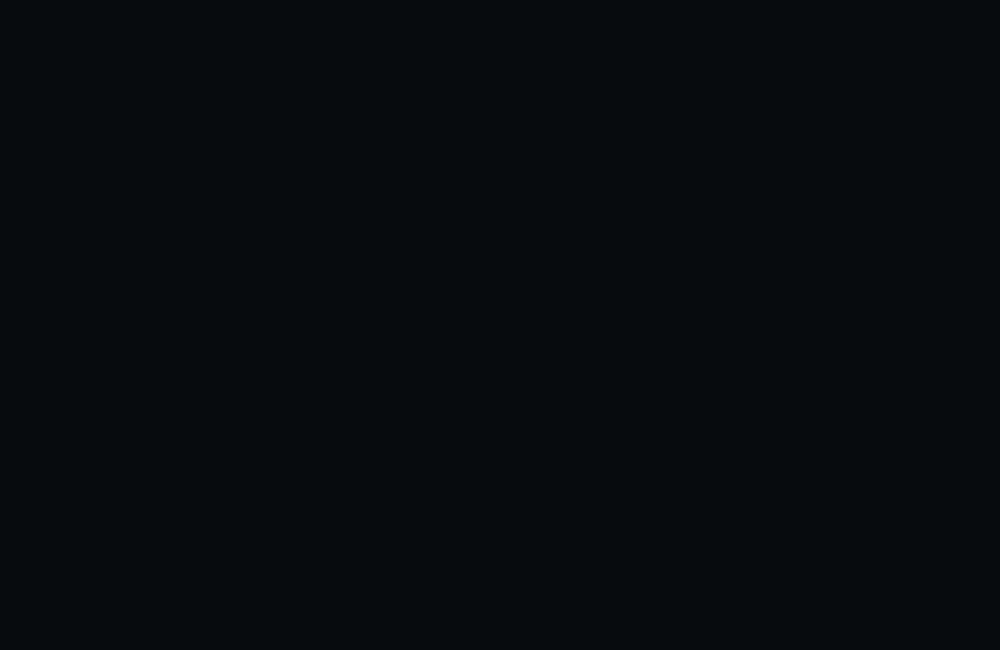
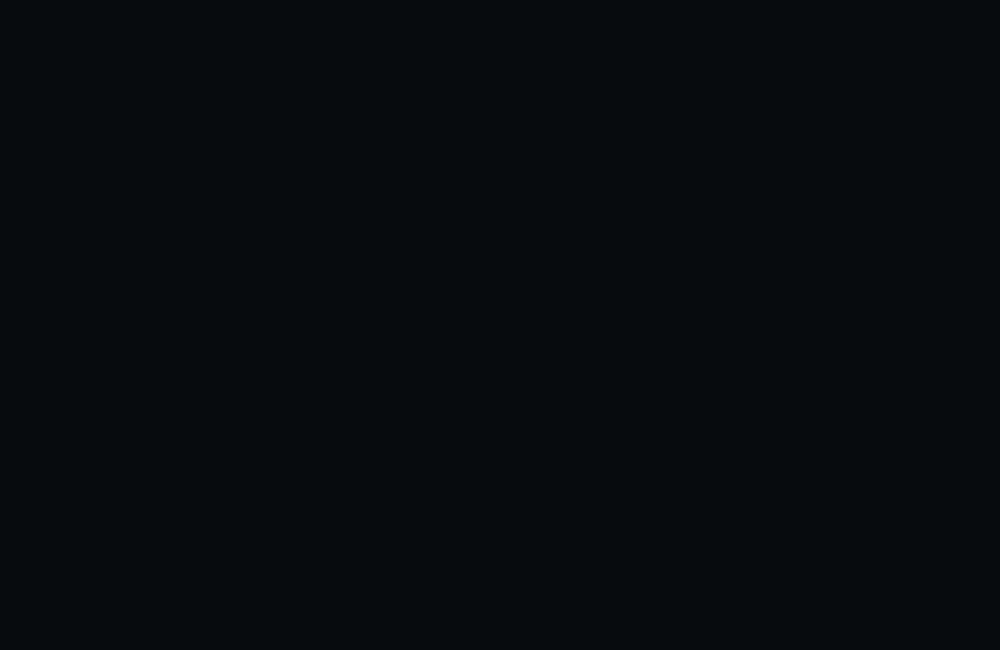
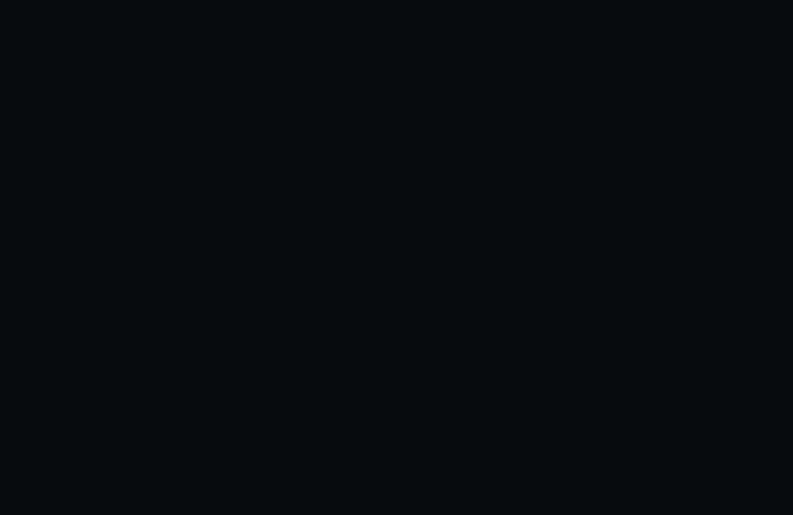
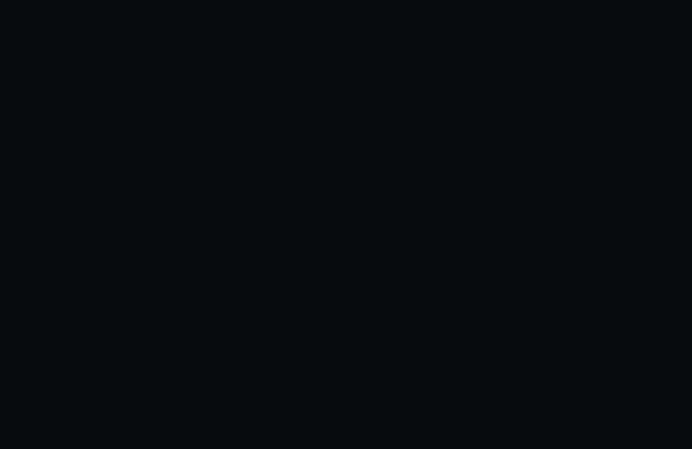
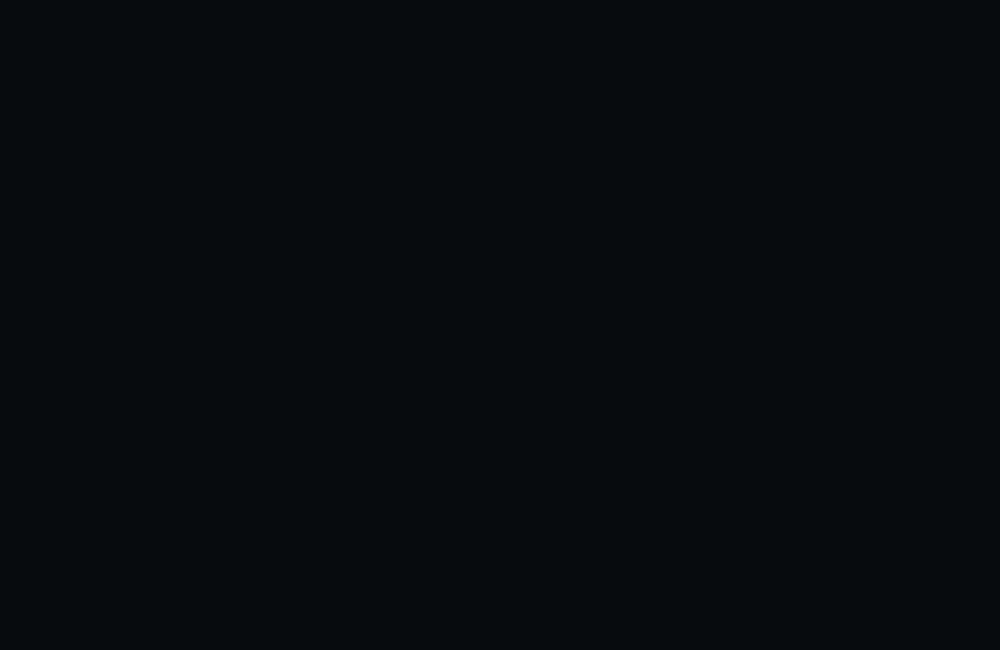
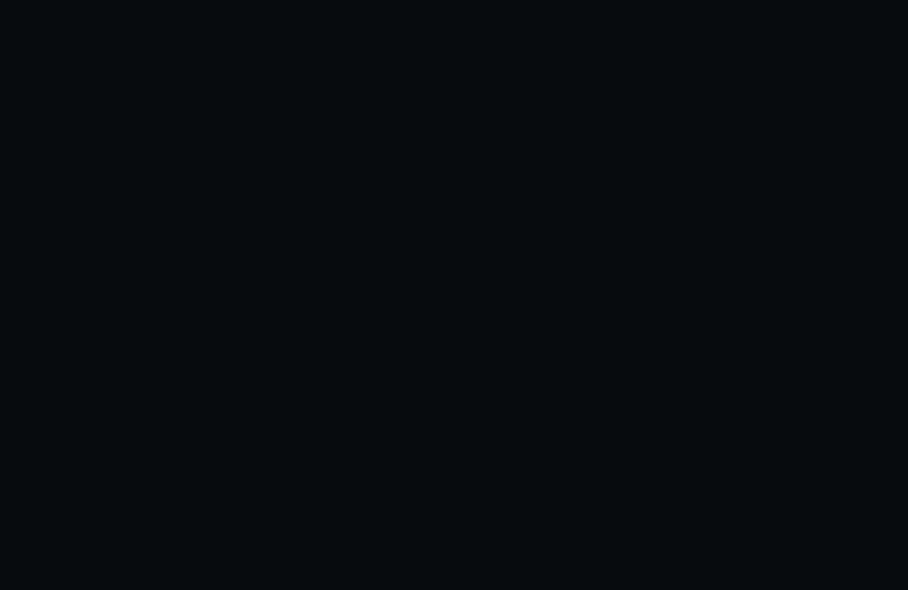
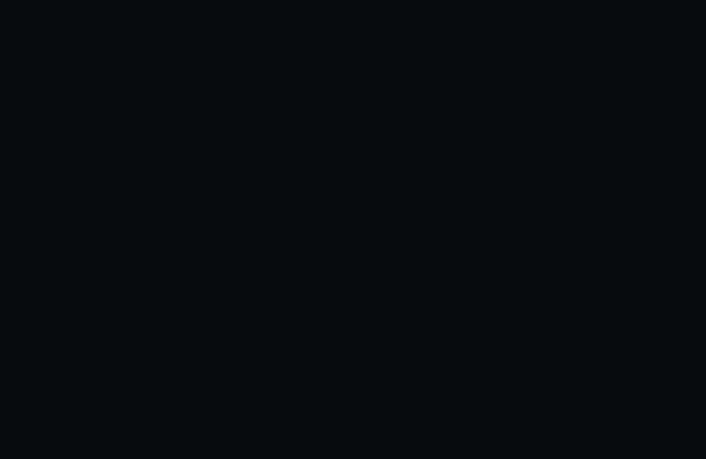

# Flux Files Viewer Guide
**Comprehensive Multi-Format File Inspection System**  
*Quelravo Systems • Fast. Local. Private. Simple.*

---

Flux Files features an integrated multi-format file inspection engine that eliminates the need to launch heavyweight external software just to inspect file contents. Select any supported file in the explorer and press **Spacebar** to toggle the right-hand Inspector pane, or view items directly within the workspace.

---

## 1. Markdown Documentation Viewer

- **Supported Formats**: `.md`, `.markdown`, `.mdown`
- **How to Open**: Select any markdown file and press `Spacebar`, or click the Inspector icon in the toolbar.
- **Interface & Controls**:
  - Full GitHub Flavored Markdown (GFM) renderer.
  - Interactive table of contents outline.
  - Syntax highlighted inline and fenced code blocks.
  - Formatted tables with horizontal scroll support.
- **Key Actions**: Select and copy text directly from the rendered view; click "Edit" in the viewer header to open the live editor.
- **Technical Specifications**: Renders entirely locally without network access or remote CDN font/stylesheet dependencies.

---

## 2. Code & Plain Text Viewer

- **Supported Formats**: `.ts`, `.js`, `.tsx`, `.jsx`, `.py`, `.rs`, `.go`, `.cpp`, `.c`, `.h`, `.cs`, `.java`, `.html`, `.css`, `.scss`, `.sql`, `.sh`, `.ps1`, `.bat`, `.txt`, `.log`
- **How to Open**: Highlight file and press `Spacebar`.
- **Interface & Controls**:
  - Crisp line numbering column.
  - Syntactic token coloring based on detected language grammar.
  - Bracket pair colorization.
  - Word wrap toggle button (`Alt+Z`).
- **Key Actions**: Select text with line numbers or copy pure raw code; click "Open in Editor" (`Ctrl+E`) to modify.
- **Performance**: Virtualized text buffer handles large multi-megabyte log files smoothly without UI stutter.

---

## 3. JSON & Data Structure Viewer

- **Supported Formats**: `.json`, `.jsonc`, `.geojson`
- **How to Open**: Highlight JSON document and press `Spacebar`.
- **Interface & Controls**:
  - Interactive hierarchical tree view with collapsible nodes.
  - Color-coded primitives (strings, numbers, booleans, null values).
  - Key-value count badges on objects and arrays.
  - "Format / Beautify" toggle for minified JSON payloads.
- **Key Actions**: Click node expanders to collapse or reveal subtrees; copy individual node values or full JSON paths.
- **Validation**: Displays a green validation checkmark for valid JSON or highlights syntax parse errors with line numbers.

---

## 4. CSV & Tabular Data Viewer

- **Supported Formats**: `.csv`, `.tsv`
- **How to Open**: Highlight CSV or TSV file and press `Spacebar`.
- **Interface & Controls**:
  - Virtualized spreadsheet-style data grid with sticky header row.
  - Auto-detected column delimiters (comma, tab, semicolon, pipe).
  - Resizable column dividers.
  - Click-to-sort by any column in ascending or descending sequence.
- **Key Actions**: Quick row count metric; cell value selection and clipboard copy.
- **Scale**: Handles datasets containing up to 100,000 rows with instantaneous scrolling.

---

## 5. PDF Document Viewer

- **Supported Formats**: `.pdf`
- **How to Open**: Highlight PDF file and press `Spacebar`.
- **Interface & Controls**:
  - Continuous vertical multi-page scroll canvas.
  - Page navigation controls: Previous, Next, Jump to Page Number.
  - Zoom controls: Zoom In (`+`), Zoom Out (`-`), Fit to Width, Fit Entire Page.
- **Key Actions**: In-document text search; page rotation; open in default system PDF reader.
- **Architecture**: Powered by local PDF rendering with zero external telemetric plugins.

---

## 6. Binary Hexadecimal Viewer

- **Supported Formats**: `.bin`, `.dat`, `.exe`, `.dll`, `.sys`, `.iso`, and any unrecognized file extension.
- **How to Open**: Right-click file and choose **Open in Hex Viewer**, or toggle Inspector on binary files.
- **Interface & Controls**:
  - 16-byte aligned hexadecimal byte grid.
  - Left column: Hexadecimal offset address.
  - Center columns: Raw byte values in 2-digit hex notation.
  - Right column: ASCII printable character decoding (non-printable bytes shown as dots `.`).
- **Key Actions**: Jump to offset address; copy hex string or ASCII representation.
- **Performance**: Streams byte chunks asynchronously from disk, enabling forensic inspection of files exceeding 10 GB.

---

## 7. 3D Model & Spatial Mesh Viewer

- **Supported Formats**: `.obj`, `.stl`, `.gltf`, `.glb`
- **How to Open**: Highlight 3D mesh file and press `Spacebar`.
- **Interface & Controls**:
  - Hardware-accelerated WebGL viewport.
  - Orbit camera: Click and drag left mouse button.
  - Pan camera: Click and drag right mouse button or middle click.
  - Zoom camera: Mouse scroll wheel.
  - View modes: Solid shaded surface, Wireframe mesh, Bounding box dimensions.
- **Metadata**: Displays vertex count, face/triangle count, and spatial dimensions (X, Y, Z extents).

---

## 8. Typography Font Specimen Viewer

- **Supported Formats**: `.ttf`, `.otf`, `.woff`, `.woff2`
- **How to Open**: Highlight font file and press `Spacebar`.
- **Interface & Controls**:
  - Waterfall size specimen display (12pt, 18pt, 24pt, 36pt, 48pt, 72pt).
  - Interactive sample text entry field (custom pangrams and character strings).
  - Complete Unicode glyph grid table.
- **Metadata**: Displays font family name, subfamily/style, PostScript name, version, and copyright holder.

---

## 9. CAD Wireframe Inspector

- **Supported Formats**: `.dxf`
- **How to Open**: Highlight CAD vector file and press `Spacebar`.
- **Interface & Controls**:
  - High-precision 2D vector drawing canvas.
  - Pan and zoom across infinite CAD coordinate planes.
  - Layer visibility toggles.
- **Metadata**: Layer counts, entity metrics (lines, arcs, polylines, circles).

---

## 10. Database Schema & Table Inspector

- **Supported Formats**: `.sqlite`, `.sqlite3`, `.db`
- **How to Open**: Highlight SQLite database and press `Spacebar`.
- **Interface & Controls**:
  - Table selection dropdown listing all relational tables and views.
  - Schema column definition inspector (data types, primary keys, nullability).
  - Tabular record preview showing the first 500 rows.
- **Safety**: Strictly read-only connection; prevents accidental modifications or lockups to operational databases.

---

## 11. AI / ML Tensor & Model Inspector

- **Supported Formats**: `.onnx`, `.safetensors`
- **How to Open**: Highlight machine learning model file and press `Spacebar`.
- **Interface & Controls**:
  - Model metadata extraction: Producer name, version, opset version.
  - Input and output tensor shape specifications and data types.
  - Named tensor dictionary with byte offsets and parameter counts.
