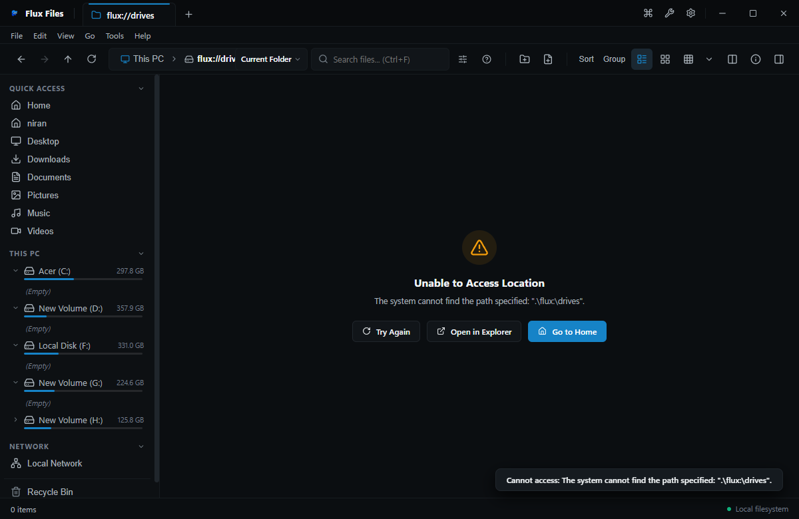

# Flux Files Windows Integration Guide
**Native Operating System Coexistence & Desktop Features**  
*Quelravo Systems • Fast. Local. Private. Simple.*

---

Flux Files is purpose-built for Microsoft Windows (Windows 10 and Windows 11). Rather than behaving as an isolated sandbox, Flux Files embraces Windows shell standards, NTFS filesystem capabilities, and desktop conventions.

---

## 1. Native Windows Shell Integration

### NTFS Attributes & Metadata
Flux Files interacts directly with Windows filesystem metadata APIs:
- **Attributes**: Accurately inspects and respects Windows file attributes:
  - `FILE_ATTRIBUTE_READONLY`
  - `FILE_ATTRIBUTE_HIDDEN`
  - `FILE_ATTRIBUTE_SYSTEM`
  - `FILE_ATTRIBUTE_ARCHIVE`
- **Timestamps**: Reads and renders 64-bit Windows NTFS timestamps: Created Date, Modified Date, and Last Accessed Date.
- **NTFS Alternate Data Streams & Security**: Identifies zone identifiers and download security stamps.

---

## 2. Recycle Bin Safety Architecture

When deleting items, Flux Files by default executes safe deletion via the Windows Shell API (`SHFileOperation` / IFileOperation):
- Files sent to the Recycle Bin retain their original location metadata and can be fully restored via Windows Recycle Bin at any time.
- Permanent deletion (`Shift+Delete`) bypasses the Recycle Bin only after displaying an explicit confirmation dialog.

---

## 3. "Open With" Application Dispatch

While Flux Files includes built-in viewers and editors, you can dispatch any file to external Windows desktop applications instantly:
- **Default Application**: Double-click or press `Enter` to launch the file using the default Windows file association.
- **Open With Picker**: Select any item and press **`Ctrl+Shift+O`** or right-click and select **Open With...**. Flux Files queries the Windows registry to present compatible installed applications.

---

## 4. Drive Detection & Volume Metrics

Flux Files actively monitors Windows hardware storage notifications:
- **Volume Enumeration**: Accurately tracks fixed NTFS/FAT32 drives (`C:\`, `D:\`), removable USB drives, CD/DVD optical media, and mapped network drives (`Z:\`).
- **Dynamic Hot-Plugging**: Inserting a USB flash drive or mounting a virtual disk image automatically refreshes the sidebar and This PC view without requiring manual app reloads.
- **Drive Capacity Meters**: Real-time visualization of used vs. free disk storage space using color-coded progress bars.

---

## 5. Long Path Support (NTFS Extended Paths)

Traditional Windows applications frequently crash or report errors when encountering directory structures exceeding the legacy 260-character `MAX_PATH` limit.
- Flux Files natively uses the extended NTFS path prefix (`\\?\C:\...`) for all internal filesystem operations.
- Deep nested project folders (such as deep `node_modules` or recursive build artifacts) can be browsed, copied, renamed, and deleted with complete reliability.

---

## 6. Drag & Drop Interoperability

Flux Files supports bidirectional desktop drag-and-drop:
- Drag files directly from Flux Files into external Windows applications (e.g. Photoshop, VS Code, Discord, Outlook, Windows Explorer).
- Drag files from Windows Explorer or the Windows Desktop into any open folder tab in Flux Files to initiate immediate copying or moving.
